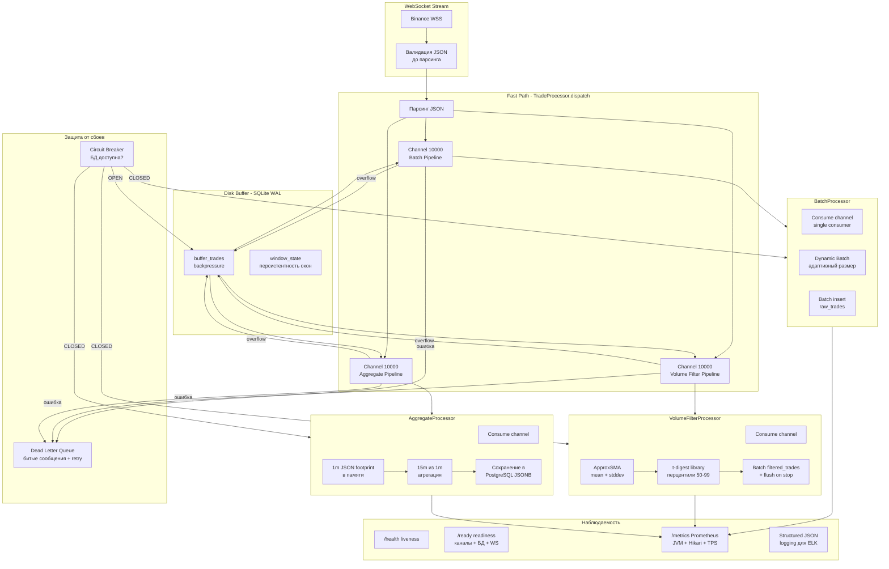

# План рефакторинга TradeCollectorService v0.1 — исправление критических проблем

## Легенда

| Статус | Описание |
|--------|----------|
| ✅ Fixed | Проблема решена / неактуальна по решению |
| 🔴 TODO | Требует реализации |
| 🟡 TODO | Средний приоритет |
| 🟢 Later | Можно отложить |

---

## 1. 🔴 TODO: Асинхронная обработка трёх конвейеров + Backpressure + DLQ

**Локация:** [`TradeProcessor.process()`](src/main/kotlin/service/TradeProcessor.kt:79)

### Что делаем:

**a. Разделение на параллельные конвейеры:**
- `TradeProcessor.process()` становится лёгким диспетчером — только парсинг JSON и распределение по трём независимым каналам
- Каждый конвейер (Batch, VolumeFilter, Aggregate) работает в своём `CoroutineScope` с собственным `Dispatchers.IO`
- Каждый конвейер имеет отдельный `Channel<Trade>` с буфером (capacity = 10000, `BufferOverflow.DROP_OLDEST`)

```kotlin
WebSocket → ExchangeClient → TradeProcessor.process() (fast path)
    ├── Channel(10000) → BatchProcessor.launch { consume() }
    ├── Channel(10000) → VolumeFilterProcessor.launch { consume() }  
    └── Channel(10000) → AggregateProcessor.launch { consume() }
```

- Каждый конвейер обрабатывает ошибки через try/catch, не влияя на другие
- При переполнении канала (backpressure) — дропаем старые сообщения, новые обрабатываются

**b. Dead Letter Queue (DLQ):**
- Сейчас при `catch (e: Exception)` в любом конвейере тик просто теряется
- Создаём `DLQ` — отдельную таблицу в SQLite для "битых" JSON или упавших вставок
- DLQ запись: `{ exchange, symbol, json_raw, error_message, created_at, retry_count }`
- Фоновый job раз в N минут пытается retry DLQ-записи (max 3 попытки, затем компрессия в архив)
- DLQ покрывает: парсинг JSON, вставку в БД, обработку VolumeFilter, обработку Aggregate

**c. Буфер на диск при backpressure:**
- Если `Channel` заполнен > 80%, включается режим сброса на диск
- Используем SQLite как временный буфер (зависимость уже есть `sqlite-jdbc`)
- SQLite настройки: `PRAGMA journal_mode=WAL; PRAGMA synchronous=NORMAL;` — даёт ~10-20x ускорение записи
- При снижении нагрузки ниже 50% — дообрабатываем данные из SQLite
- Механизм: `TradeProcessor` имеет `DiskBuffer` — обёртку над SQLite с TTL

**d. Валидация входящих данных до парсинга:**
- Быстрая проверка структуры JSON до вызова `jacksonObjectMapper().readTree()` (дорогой)
- Эвристики: длина строки, наличие ключевых полей (`e`/`topic`), валидность JSON по первому символу
- Фильтрация ping/subscribe ответов на уровне `ExchangeClient` до передачи в `TradeProcessor`

**Файлы для изменений:** [`TradeProcessor.kt`](src/main/kotlin/service/TradeProcessor.kt), [`BatchProcessor.kt`](src/main/kotlin/service/BatchProcessor.kt), [`VolumeFilterProcessor.kt`](src/main/kotlin/service/VolumeFilterProcessor.kt), [`AggregateProcessor.kt`](src/main/kotlin/service/AggregateProcessor.kt), [`ExchangeClient.kt`](src/main/kotlin/service/ExchangeClient.kt), новый [`DiskBuffer.kt`], новый [`DeadLetterQueue.kt`]

---

## 2. 🔴 TODO: Замена AggregateProcessor — отказ от Apache Arrow, JSON-формат

**Локация:** [`AggregateProcessor.kt`](src/main/kotlin/service/AggregateProcessor.kt)

### Что делаем:

**a. Почему Arrow не нужен для footprint:**
- Apache Arrow — для columnar аналитики над большими прямоугольными датасетами
- Footprint-свечи — это **непрямоугольные** данные: количество ценовых уровней разное (от 1 до 1000+)
- Для минутных свечей объём данных мизерный (< 1 MB в день на инструмент)
- Сериализация/десериализация Arrow добавляет latency и complexity без выгоды

**b. Новый формат хранения:**
- Footprint-свечи храним как JSON-структуру в PostgreSQL (колонка `JSONB`)
- Поля свечи: `exchange`, `symbol`, `timeframe` (1m, 15m), `start_time`, `end_time`, `price_levels: JSONB`
- JSON структура `price_levels`:
```json
{
  "levels": [
    {"p": "100.50", "bv": "1.2345", "av": "0.5678", "bc": 10, "ac": 5},
    {"p": "100.60", "bv": "0.0", "av": "2.3456", "bc": 0, "ac": 15}
  ],
  "total_ticks": 150,
  "min_price": "100.10",
  "max_price": "101.20"
}
```
- Цены и объёмы — строки (String), никакой потери точности
- Читаемость без специальных инструментов, можно анализировать прямо в SQL: `SELECT price_levels->'levels' FROM aggregates`

**c. Таймфреймы:**
- Убираем 5m (не даёт преимущества над 1m)
- Оставляем только **1m** и **15m** (15x > 5x)
- 15m строится из 1m агрегатов (на этапе запроса)

**d. Очистка:**
- Удаляем зависимости Apache Arrow из `build.gradle.kts`
- Удаляем `AggregateCandleBuilder.buildArrowData()` и `RootAllocator`
- Утечка off-heap памяти устранена

**Файлы для изменений:** [`AggregateProcessor.kt`](src/main/kotlin/service/AggregateProcessor.kt), [`AggregateCandle.kt`](src/main/kotlin/model/AggregateCandle.kt), [`TradeDAO.kt`](src/main/kotlin/storage/postgres/TradeDAO.kt), [`sql/001_init_schema.sql`](sql/001_init_schema.sql), [`build.gradle.kts`](build.gradle.kts)

---

## 3. 🔴 TODO: Переработка VolumeFilterProcessor — t-digest + ApproxSMA

**Локация:** [`VolumeFilterProcessor.kt`](src/main/kotlin/service/VolumeFilterProcessor.kt)

### 3.1. Разделение ApproxSMA и t-digest (библиотека)

**Два отдельных компонента, не смешивать:**

- **ApproxSMA** (самописный, новый файл `src/main/kotlin/util/ApproxSMA.kt`) — для mean/stddev через скользящее среднее
- **t-digest** — готовая библиотека [`com.tdunning:t-digest`](https://github.com/tdunning/t-digest), класс `com.tdunning.math.stats.TDigest` (добавить зависимость в `build.gradle.kts`)

**VolumeWindowTracker** — объединяет оба:

```kotlin
class VolumeWindowTracker(
    private val sma: ApproxSMA,
    private val digest: TDigest  // com.tdunning.math.stats.TDigest
) {
    fun ingest(volumeUsd: BigDecimal) {
        sma.add(volumeUsd)
        digest.add(volumeUsd.toDouble())
    }
    fun getSnapshot() = WindowStats(
        mean = sma.mean,
        stddev = sma.stddev,
        p50 = digest.quantile(0.50),
        p60 = digest.quantile(0.60),
        p70 = digest.quantile(0.70),
        p80 = digest.quantile(0.80),
        p85 = digest.quantile(0.85),
        p90 = digest.quantile(0.90),
        p95 = digest.quantile(0.95),
        p98 = digest.quantile(0.98),
        p99 = digest.quantile(0.99)
    )
}
```

### 3.2. Персистентность скользящего окна

**a. Сохранение состояния при shutdown:**
- `ApproxSMA.snapshot()` → сохраняем `sum`, `count`, `sumSquares` в SQLite
- `TDigest.asBytes()` (встроенный метод библиотеки) → сохраняем бинарное представление t-digest в SQLite
- При `start()` — загружаем последнее сохранённое состояние через `TDigest.fromBytes()`
- Если состояние устарело (прошло > 1 часа) — начинаем с нуля

**b. Ручная настройка big trades:**
- Добавить в `config.json`: `manualThresholds: { "LTCUSDT": "1000" }` — в USD
- Пока нет накопленной статистики (первые N сделок), используем manualThreshold
- Когда статистика накоплена — сравниваем оба порога и берём меньший

### 3.3. Сброс processedTrades

- Сбрасывать счётчик `processedTrades` каждый календарный час
- `val period = System.currentTimeMillis() / 3_600_000` — считаем сделки за текущий час

### 3.4. Batch для filtered_trades

- Добавить `FilteredTradeBatchBuffer` — буфер на N элементов (batchSize из конфига)
- Флаш при достижении batchSize ИЛИ по таймеру (каждые 1000 ms)
- При `shutdown()` — принудительный flush всех буферов
- DLQ при ошибке вставки батча

**Файлы для изменений:** [`VolumeFilterProcessor.kt`](src/main/kotlin/service/VolumeFilterProcessor.kt), новый [`ApproxSMA.kt`](src/main/kotlin/util/ApproxSMA.kt), новый [`VolumeWindowTracker.kt`](src/main/kotlin/util/VolumeWindowTracker.kt), [`config/AppConfig.kt`](src/main/kotlin/config/AppConfig.kt), [`TradeDAO.kt`](src/main/kotlin/storage/postgres/TradeDAO.kt), [`build.gradle.kts`](build.gradle.kts) — добавить `com.tdunning:t-digest`

---

## 4. 🔴 TODO: Устранение Race Condition в BatchProcessor + Circuit Breaker

**Локация:** [`BatchProcessor.kt`](src/main/kotlin/service/BatchProcessor.kt)

### Решение:

**a. Переход на Channel:**
- Использовать один **single-consumer канал**: `Channel<Trade>(Channel.UNLIMITED)` для каждого инструмента
- Только `processBatchLoop()` имеет право вызывать `flushBatch()`
- `addTrade()` только отправляет в канал через `trySend()`, не флашит никогда
- Механизм очистки каналов при отключении инструмента:
```kotlin
private val cleanupJob = scope.launch {
    while (isActive) {
        delay(5.minutes)
        tradeChannels.entries.removeAll { (_, ch) -> ch.isEmpty && ch.isClosedForReceive }
    }
}
```

**b. Circuit Breaker для БД:**
- Простой счётчик ошибок: при 5 последовательных ошибках вставки переходим в режим `OPEN`
- В режиме `OPEN`: данные не теряются, а уходят в `DiskBuffer` (SQLite)
- Через 30 секунд пробуем `HALF_OPEN` — один запрос на проверку
- Если успех → `CLOSED`, дообрабатываем из DiskBuffer
- Если ошибка → снова `OPEN`, ждём 60 секунд

**Файлы для изменений:** [`BatchProcessor.kt`](src/main/kotlin/service/BatchProcessor.kt), новый [`CircuitBreaker.kt`](src/main/kotlin/util/CircuitBreaker.kt)

---

## 5. 🔴 TODO: Graceful shutdown + Persistence

**Локация:** [`Main.kt`](src/main/kotlin/Main.kt:90-98), [`TradeCollectorService.stop()`](src/main/kotlin/service/TradeCollectorService.kt:100)

### Решение:

1. **Правильная последовательность остановки:**
   1. Останавливаем **клиентов** (ExchangeClient) — закрываем WebSocket
   2. **Ждём** 2 секунды — дополняются данные из WebSocket буферов
   3. **Флашим все процессоры** — Batch.flush(), VolumeFilter.flush(), Aggregate.flush()
   4. **Сохраняем состояние окон** — ApproxSMA.snapshot() + TDigest.asBytes() → SQLite
   5. Останавливаем **мониторинг**
   6. Отменяем **coroutineScope**

2. **`withTimeout(30.seconds)` для каждой стадии** — чтобы сервис не завис навсегда

3. **MonitoringServer:**
   - Заменить `serverJob?.cancel()` на `server?.stop(gracePeriod = 1, timeout = 5, TimeUnit.SECONDS)`

**Файлы для изменений:** [`TradeCollectorService.kt`](src/main/kotlin/service/TradeCollectorService.kt), [`Main.kt`](src/main/kotlin/Main.kt), [`MonitoringServer.kt`](src/main/kotlin/service/MonitoringServer.kt)

---

## 6. 🔴 TODO: SQLite как диск-буфер + персистентность окон + DLQ

**Локация:** Новые файлы

### Решение:

- Используем SQLite (уже есть зависимость) для трёх целей:
  1. **Буфер при backpressure** — если каналы переполнены, сбрасываем сырые сделки в SQLite
  2. **Персистентность состояния окна** — сохраняем ApproxSMA + TDigest состояние при shutdown
  3. **Dead Letter Queue** — битые сообщения для retry

- Файл SQLite: `./data/trade_buffer.db`
- Таблицы:
  - `buffer_trades` (id, exchange, symbol, json_data, created_at, ttl) — backpressure
  - `window_state` (key, state_json, updated_at) — персистентность окон
  - `dlq` (id, exchange, symbol, json_raw, error, retry_count, created_at) — DLQ

- SQLite PRAGMA: `journal_mode=WAL; synchronous=NORMAL; page_size=4096; cache_size=-8000`

**Файлы для изменений:** новый [`DiskBuffer.kt`](src/main/kotlin/storage/DiskBuffer.kt), новый [`DeadLetterQueue.kt`](src/main/kotlin/storage/DeadLetterQueue.kt), [`TradeProcessor.kt`](src/main/kotlin/service/TradeProcessor.kt)

---

## 7. 🟡 TODO: Потокобезопасность InstrumentStats + компактное логирование

**Локация:** [`TradeProcessor.kt`](src/main/kotlin/service/TradeProcessor.kt:89-92)

### Решение:

**a. Atomic-поля:**
```kotlin
data class InstrumentStats(
    val totalTrades: AtomicLong = AtomicLong(0),
    val lastTradeTime: AtomicLong = AtomicLong(0),
    val batchQueueSize: AtomicInteger = AtomicInteger(0)
)
```

**b. Логирование одной строкой раз в 5 минут:**
```
📊 TradeProcessor [BTCUSDT: 150k/s queue=230] [ETHUSDT: 120k/s queue=45]
```

**Файлы для изменений:** [`TradeProcessor.kt`](src/main/kotlin/service/TradeProcessor.kt)

---

## 8. 🟡 TODO: Circuit Breaker для БД (подробно)

**Локация:** Новый [`CircuitBreaker.kt`](src/main/kotlin/util/CircuitBreaker.kt)

### Состояния:

CLOSED → при 5 ошибках подряд → OPEN
OPEN → через 30s → HALF_OPEN  
HALF_OPEN → 1 тестовый запрос: успех → CLOSED, ошибка → OPEN (ждать 60s)

- В режиме `OPEN`: все процессоры переключаются на запись в DiskBuffer (SQLite)
- При возврате в `CLOSED`: дообрабатываем данные из DiskBuffer

**Файлы для изменений:** новый [`CircuitBreaker.kt`](src/main/kotlin/util/CircuitBreaker.kt), [`TradeDAO.kt`](src/main/kotlin/storage/postgres/TradeDAO.kt), [`BatchProcessor.kt`](src/main/kotlin/service/BatchProcessor.kt)

---

## 9. 🟡 TODO: Micrometer + Prometheus метрики

**Локация:** [`MonitoringServer.kt`](src/main/kotlin/service/MonitoringServer.kt), [`TradeProcessor.kt`](src/main/kotlin/service/TradeProcessor.kt)

### Решение:

- Заменить кастомный `/metrics` на `io.micrometer.core` + `micrometer-registry-prometheus`
- Готовые метрики: JVM (GC, память, threads), HikariCP pool, размер каналов, latency процессоров, TPS
- Эндпоинт `/metrics` в формате Prometheus (text/plain)
- Без перехода на полноценный Micrometer — пока просто добавить Prometheus-совместимый вывод

```kotlin
// Минимальный набор метрик:
// trade_trades_total{exchange,symbol} — counter
// trade_queue_size{exchange,symbol} — gauge
// trade_channel_buffer_usage — gauge
// trade_filtered_trades_total{category} — counter
```

**Файлы для изменений:** [`MonitoringServer.kt`](src/main/kotlin/service/MonitoringServer.kt), [`TradeProcessor.kt`](src/main/kotlin/service/TradeProcessor.kt), [`build.gradle.kts`](build.gradle.kts)

---

## 10. 🟡 TODO: Dynamic Batch Sizing

**Локация:** [`BatchProcessor.kt`](src/main/kotlin/service/BatchProcessor.kt), [`AppConfig.kt`](src/main/kotlin/config/AppConfig.kt)

### Решение:

- Фиксированный `batchSize=1000` не оптимален при разной нагрузке
- Адаптивный алгоритм:
  - Если latency вставки < 10ms → увеличиваем batchSize на 10% (до max 10000)
  - Если latency > 100ms → уменьшаем batchSize на 20% (до min 100)
  - Измеряем latency по времени выполнения `executeBatch()`

**Файлы для изменений:** [`BatchProcessor.kt`](src/main/kotlin/service/BatchProcessor.kt)

---

## 11. 🟡 TODO: CI/CD — передача переменных в SSH heredoc

**Локация:** [`.github/workflows/deploy.yml`](.github/workflows/deploy.yml:73)

### Решение:

Передавать переменные как аргументы ssh, не используя heredoc:
```bash
ssh -i ~/.ssh/vps_key user@host "DB_PASSWORD='${{ secrets.DB_PASSWORD }}' DB_HOST='${{ secrets.DB_HOST }}' bash -s" << 'EOF'
    export DB_PASSWORD="$1"
    export DB_HOST="$2"
    ./deploy-remote.sh
EOF
```

**Файлы для изменений:** [`.github/workflows/deploy.yml`](.github/workflows/deploy.yml)

---

## 12. 🟢 Later: Health/Readiness Probes

**Локация:** [`MonitoringServer.kt`](src/main/kotlin/service/MonitoringServer.kt)

### Решение:

- `/health` (liveness) — сервис жив и отвечает
- `/ready` (readiness) — каналы не переполнены, БД доступна, WS подключены, CircuitBreaker не OPEN
- Для Kubernetes/Docker

**Файлы для изменений:** [`MonitoringServer.kt`](src/main/kotlin/service/MonitoringServer.kt)

---

## 13. 🟢 Later: Structured Logging (JSON)

**Локация:** [`Main.kt`](src/main/kotlin/Main.kt)

### Решение:

- Заменить `mu.KotlinLogging` на `net.logstash.logback` или `logback` с JSON-аппендером
- Формат: `{"timestamp": "...", "level": "INFO", "logger": "...", "message": "...", "exchange": "Binance", "symbol": "BTCUSDT"}`
- Для ELK/Loki/Grafana

**Файлы для изменений:** [`build.gradle.kts`](build.gradle.kts), новый `logback-spring.xml`

---

## 14. ✅ Fixed: Bybit временно отключён

- Bybit отключён в `config.json` (и production.json)
- Архитектура `ExchangeAdapter` / `ExchangeAdapterFactory` остаётся — можно включить позже
- При включении нужно будет исправить URL на futures

---

## 15. ✅ Fixed: raw_trades больше не храним, ApproxSMA + t-digest вместо сырых данных

- Таблица `raw_trades` может быть удалена или оставлена для опционального логирования
- Перцентили рассчитываются через t-digest (библиотека `com.tdunning:t-digest`), среднее/stddev через ApproxSMA
- Функция `cleanup_old_raw_trades()` не нужна

---

## 16. ✅ Fixed: Пароль в Git — пока не трогаем

---

## 17. ✅ Fixed: Версия Kotlin 2.2.20 — корректна для мая 2026

---

## Диаграмма целевой архитектуры



## Приоритетный порядок внедрения

| Шаг | Что делаем | Затрагиваемые файлы |
|-----|-----------|-------------------|
| **1** | t-digest + ApproxSMA + VolumeWindowTracker | 2 новых файла, VolumeFilterProcessor, **build.gradle.kts** (добавить `com.tdunning:t-digest`) |
| **2** | Каналы + backpressure + DROP_OLDEST в TradeProcessor | TradeProcessor, все процессоры |
| **3** | BatchProcessor → Channel + Circuit Breaker | BatchProcessor, CircuitBreaker |
| **4** | DLQ + SQLite DiskBuffer + Persistence | DiskBuffer, DeadLetterQueue |
| **5** | AggregateProcessor → JSON вместо Arrow | AggregateProcessor, модель, DAO, SQL |
| **6** | Graceful shutdown | TradeCollectorService, Main, MonitoringServer |
| **7** | InstrumentStats + компактное логирование | TradeProcessor |
| **8** | Micrometer метрики | MonitoringServer, build.gradle.kts |
| **9** | Dynamic Batch Sizing | BatchProcessor |
| **10** | CI/CD fix | deploy.yml |
| **11** | Health/Readiness | MonitoringServer |
| **12** | Structured Logging | build.gradle.kts, logback config |

## Сводка изменений по файлам

| # | Файл | Что делаем |
|---|------|-----------|
| 1 | [`TradeProcessor.kt`](src/main/kotlin/service/TradeProcessor.kt) | Каналы, backpressure, DLQ, DiskBuffer, потокобезопасность, валидация |
| 2 | [`VolumeFilterProcessor.kt`](src/main/kotlin/service/VolumeFilterProcessor.kt) | t-digest библиотека + ApproxSMA, правильные перцентили, batch filtered_trades |
| 3 | [`AggregateProcessor.kt`](src/main/kotlin/service/AggregateProcessor.kt) | Отказ от Arrow, JSON-формат, 1m+15m таймфреймы |
| 4 | [`BatchProcessor.kt`](src/main/kotlin/service/BatchProcessor.kt) | Channel, Circuit Breaker, Dynamic Batch, cleanup каналов |
| 5 | [`TradeCollectorService.kt`](src/main/kotlin/service/TradeCollectorService.kt) | Правильный graceful shutdown |
| 6 | [`MonitoringServer.kt`](src/main/kotlin/service/MonitoringServer.kt) | Prometheus метрики, правильная остановка, health/readiness |
| 7 | [`Main.kt`](src/main/kotlin/main.kt) | Улучшенный shutdown hook |
| 8 | [`ExchangeClient.kt`](src/main/kotlin/service/ExchangeClient.kt) | Валидация JSON до парсинга |
| 9 | [`TradeDAO.kt`](src/main/kotlin/storage/postgres/TradeDAO.kt) | JSONB-агрегаты, batch filtered_trades |
| 10 | [`config/AppConfig.kt`](src/main/kotlin/config/AppConfig.kt) | manualThresholds, dynamic batch config |
| 11 | [`model/AggregateCandle.kt`](src/main/kotlin/model/AggregateCandle.kt) | JSON вместо Arrow ByteBuffer |
| 12 | [`sql/001_init_schema.sql`](sql/001_init_schema.sql) | JSONB колонка для aggregates, партиционирование filtered_trades |
| 13 | [`.github/workflows/deploy.yml`](.github/workflows/deploy.yml) | Исправление передачи переменных |
| 14 | [`build.gradle.kts`](build.gradle.kts) | Arrow→удалить, добавить Micrometer и **com.tdunning:t-digest** |
| 15 | **Новый `ApproxSMA.kt`** | Аппроксимация скользящего среднего |
| 16 | **Новый `VolumeWindowTracker.kt`** | Объединяет ApproxSMA + библиотечный TDigest |
| 17 | **Новый `DiskBuffer.kt`** | SQLite буфер с WAL |
| 18 | **Новый `DeadLetterQueue.kt`** | DLQ с retry |
| 19 | **Новый `CircuitBreaker.kt`** | Защита от падения БД |
