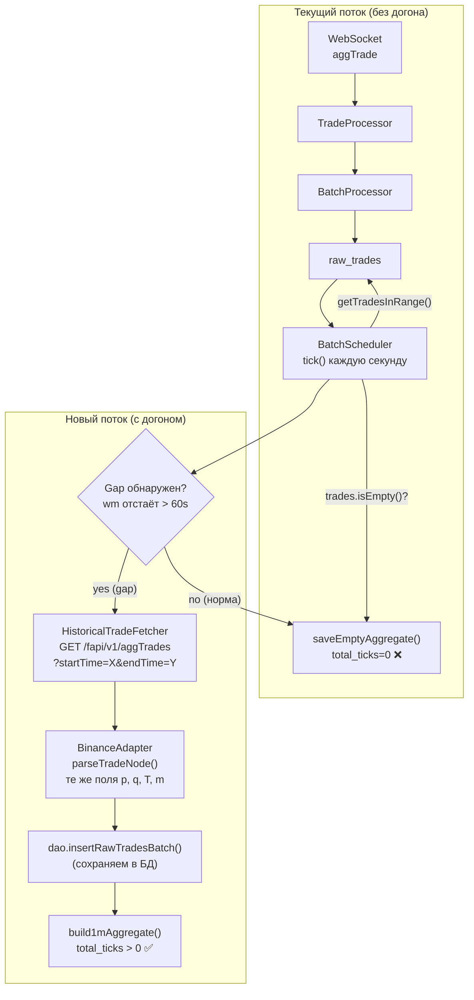
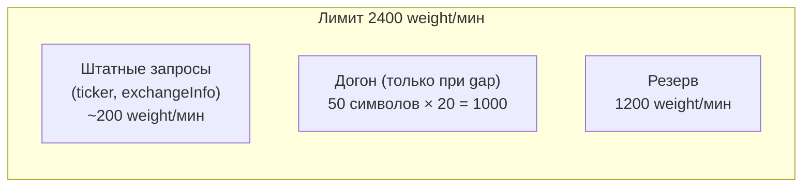

# Trade Collector v3.2 — Historical Trade Catch-Up

> **Статус**: Plan  
> **Предназначение**: заполнение пропущенных минут при разрывах WebSocket-соединения через Binance REST API  

---

## 1. Проблема

При разрыве WebSocket-соединения (watchdog disconnect, перезапуск сервиса) данные за время разрыва теряются безвозвратно. Сейчас BatchScheduler обнаруживает пропущенные минуты через watermark recovery, но строит агрегаты с `total_ticks=0` — в `raw_trades_{symbol}` нет данных за эти минуты.

**Частота**: watchdog срабатывает ~раз в 1-3 дня. Типичный gap — 2 минуты (120 секунд watchdog timeout). За 2 минуты на BTCUSDT теряется ~3000-5000 трейдов.

## 2. Решение: Binance REST API Catch-Up

### 2.1 API-эндпоинт

`GET https://fapi.binance.com/fapi/v1/aggTrades`

**Параметры:**

| Параметр | Тип | Обязательный | Описание |
|----------|-----|-------------|----------|
| `symbol` | STRING | Да | Например `BTCUSDT` |
| `startTime` | LONG | Нет | Начало диапазона (ms), INCLUSIVE |
| `endTime` | LONG | Нет | Конец диапазона (ms), INCLUSIVE |
| `limit` | INT | Нет | По умолчанию 500, максимум 1000 |

**Ограничения:**
- Глубина истории: **24 часа**
- Интервал `startTime`…`endTime`: **не более 1 часа**
- Weight: **20**
- Лимит IP: **2400 weight/мин** (для всех market-data запросов с одного IP)
- Ответ: массив JSON-объектов — плоских, без обёртки `{"stream":"...","data":{...}}`

**Формат ответа:**

```json
[
  {
    "a": 26129,          // Aggregate tradeId
    "p": "64200.00",     // Price
    "q": "0.500",        // Quantity (агрегированная — сумма нескольких сделок)
    "T": 1700000000000,  // Timestamp (ms)
    "m": true,           // Was the buyer the maker? (true = seller was taker)
    "f": 27781,          // First tradeId в агрегате
    "l": 27785           // Last tradeId в агрегате
  }
]
```

### 2.2 Совместимость с существующим WebSocket

WebSocket `aggTrade` и REST `aggTrades` — **один и тот же тип данных**. 

| Поле | WebSocket `aggTrade` | REST `aggTrades` | Значение |
|------|---------------------|------------------|----------|
| Price | `"p"` | `"p"` | Цена |
| Quantity | `"q"` | `"q"` | Количество (агрегированное) |
| Timestamp | `"T"` | `"T"` | Время в ms |
| Is buyer maker | `"m"` | `"m"` | `true` = продавец был тейкером → `isBuy = !m` |

**Ключевой вывод**: существующий метод `BinanceAdapter.parseTradeNode(node, symbol)` уже умеет парсить поля `p`, `q`, `T`, `m`. REST-ответ — это массив таких же плоских JSON-объектов. Подаём каждый элемент в `parseTradeNode` без изменений.

### 2.3 Rate Limit Анализ

```
Один запрос GET /fapi/v1/aggTrades  →  Weight 20
50 символов × 1 запрос               →  20 × 50 = 1000 weight/мин
Доступный лимит                       →  2400 weight/мин
Использовано                          →  1000 / 2400 = 42%
Свободно                              →  1400 weight/мин
```

**Худший случай**: все 50 символов одновременно теряют соединение и требуют догона. Даже в этом случае используется только 42% лимита. Оставшиеся 58% — на штатные запросы (ticker, exchangeInfo).

**Пагинация внутри одного gap**: если gap > 1 час (ограничение Binance), делается несколько запросов с шагом 1 час. Для gap в 2 минуты (watchdog) — всегда 1 запрос.

## 3. Архитектура



### 3.1 Новый компонент: `HistoricalTradeFetcher`

```kotlin
class HistoricalTradeFetcher(
    private val httpClient: HttpClient,
    private val baseUrl: String = "https://fapi.binance.com"
) {
    /**
     * Загружает пропущенные aggTrade-сделки с Binance REST API.
     * Автоматически пагинирует, если gap > 1 час (ограничение Binance).
     *
     * @param symbol  Торговая пара (e.g. "BTCUSDT")
     * @param fromMs  Начало диапазона (timestamp ms, INCLUSIVE)
     * @param toMs    Конец диапазона (timestamp ms, INCLUSIVE)
     * @return        Список Trade объектов (может быть пустым)
     * @throws        IOException при сетевых ошибках
     */
    suspend fun fetchMissedTrades(
        symbol: String,
        fromMs: Long,
        toMs: Long
    ): List<Trade> {
        if (fromMs >= toMs) return emptyList()
        
        val allTrades = mutableListOf<Trade>()
        var currentFrom = fromMs
        var totalFetched = 0
        
        // Пагинация: Binance ограничивает запрос 1 часом и 1000 записей
        while (currentFrom < toMs) {
            val chunkEnd = minOf(currentFrom + 3_600_000, toMs) // max 1 hour per request
            
            val trades = fetchChunk(symbol, currentFrom, chunkEnd)
            allTrades.addAll(trades)
            totalFetched += trades.size
            
            if (trades.size < 1000) {
                // Меньше лимита → все данные за интервал получены
                currentFrom = chunkEnd
            } else {
                // Достигнут лимит → продолжаем с последнего timestamp
                currentFrom = trades.last().timestamp + 1
            }
        }
        
        if (totalFetched > 0) {
            log.info { "Historical fetch $symbol: $totalFetched trades restored (${formatDuration(fromMs, toMs)})" }
        }
        return allTrades
    }
    
    private suspend fun fetchChunk(
        symbol: String, fromMs: Long, toMs: Long
    ): List<Trade> {
        val response: List<AggTradeResponse> = httpClient.get("$baseUrl/fapi/v1/aggTrades") {
            parameter("symbol", symbol.uppercase())
            parameter("startTime", fromMs)
            parameter("endTime", toMs)
            parameter("limit", 1000)
            contentType(ContentType.Application.Json)
        }.body()
        
        return response.mapNotNull { agg ->
            try {
                Trade(
                    exchange = "Binance",
                    symbol = symbol.uppercase(),
                    timestamp = agg.T,
                    price = BigDecimal(agg.p),
                    quantity = BigDecimal(agg.q),
                    isBuy = !agg.m
                )
            } catch (e: Exception) {
                null // пропустить битую запись
            }
        }
    }
}

@Serializable
private data class AggTradeResponse(
    @SerialName("a") val a: Long,
    @SerialName("p") val p: String,
    @SerialName("q") val q: String,
    @SerialName("T") val T: Long,
    @SerialName("m") val m: Boolean
)
```

### 3.2 Интеграция в `BatchScheduler`

Изменения в методе `processSymbol()`:

```kotlin
private fun processSymbol(symbol: String, currentMinute: Long) {
    val key = "${symbol}_1m"
    var wm = watermarks[key] ?: (currentMinute - 60_000)
    if (wm <= 0) wm = currentMinute - 60_000

    while (wm < currentMinute) {
        val start = wm
        val end = start + 60_000
        val isLastMinute = (end >= currentMinute)

        try {
            var trades = getTradesInRange(symbol, start, end)
            
            // === НОВОЕ: догон через REST если raw_trades пуст ===
            if (trades.isEmpty() && historicalFetcher != null) {
                // Gap > 60s и в пределах 24 часов (ограничение Binance aggTrades)
                val now = System.currentTimeMillis()
                val gapSize = now - start
                if (gapSize > 60_000 && gapSize <= 86_400_000) {  // > 60s, ≤ 24h
                    val fetched = historicalFetcher.fetchMissedTrades(symbol, start, end)
                    if (fetched.isNotEmpty()) {
                        // Сохраняем в raw_trades для будущих запросов
                        dao.insertRawTradesBatch(fetched)
                        trades = fetched
                        log.info { "Catch-up $symbol ${formatTime(start)}: ${
                            fetched.size} trades from REST (gap ${gapSize / 1000}s)" }
                    }
                }
            }
            
            // === Существующая логика (без изменений) ===
            if (trades.isNotEmpty()) {
                build1mAggregate(symbol, start, end, trades)
                if (isLastMinute) {
                    val recentTrades = dao.getRecentRawTrades("Binance", symbol, 10_000)
                    if (recentTrades.isNotEmpty()) {
                        recalculateVolumeStats(symbol, recentTrades, start, end)
                    }
                }
            } else {
                saveEmptyAggregate(symbol, "1m", start, end)
            }

            if (isLastMinute) {
                dao.cleanupOldRawTrades(symbol, 10_000)
                dao.cleanupOldDerivedData(symbol, 86_400_000L)
            }
        } catch (e: Exception) {
            log.warn(e) { "Batch failed for $symbol ${formatTime(start)}" }
        }

        wm = end
        watermarks[key] = wm
    }
}
```

### 3.3 Изменения в конструкторе `BatchScheduler`

```kotlin
class BatchScheduler(
    private val buffer: MinuteBuffer,          // для ликвидаций
    private val dao: TradeDAO,
    private val symbols: List<String>,
    private val config: ProcessorConfig,
    private val historicalFetcher: HistoricalTradeFetcher? = null  // ← новый параметр
)
```

## 4. Сценарии использования

### 4.1 Сценарий 1: Watchdog disconnect (типичный)

```
T=0:     WebSocket работает, сделки пишутся в raw_trades
T=60s:   WebSocket замолкает (Binance закрыл стрим без Close-фрейма)
T=180s:  Watchdog срабатывает (120s таймаут) → this@webSocket.cancel()
T=181s:  WebSocket переподключается (exponential backoff, 1s)
T=181s:  BatchScheduler продолжает работать:
         - Для минут [0-1, 1-2]: getTradesInRange() → raw_trades ЕСТЬ → обычный агрегат
         - Для минуты [2-3]: getTradesInRange() → raw_trades ПУСТО
           → gap = 181s, < 24h → fetchMissedTrades(symbol, T=120s, T=180s)
           → 1 REST запрос aggTrades (weight 20)
           → ~3000 трейдов получено → вставлено в raw_trades → агрегат ✅
```

### 4.2 Сценарий 2: Рестарт сервиса (простой < 24h)

```
T=0:     Сервис остановлен (deploy)
T=10min: Сервис запущен
T=10min: BatchScheduler.start() → watermark recovery из aggregates
         watermark = последний агрегат (T=0)
         → catch-up loop: wm=0, currentMinute=10
         → Для каждой из 10 пропущенных минут:
           getTradesInRange() → raw_trades ПУСТО
           → gap = 10min < 24h → fetchMissedTrades(symbol, start, end)
           → 1 REST запрос на минуту (weight 20 × 10 = 200)
           → Все сделки восстановлены → агрегаты построены ✅
```

### 4.3 Сценарий 3: Простой > 24h

```
→ gap > 86_400_000 → REST догон НЕ вызывается
→ saveEmptyAggregate() как и раньше (total_ticks=0)
```

### 4.4 Сценарий 4: Нормальный режим (без gap)

```
→ getTradesInRange() → raw_trades ЕСТЬ (WebSocket работает)
→ historicalFetcher НЕ вызывается (trades.isNotEmpty() = true)
→ Нулевое влияние на производительность
```

## 5. Rate Limit: не влияет на штатную работу



- При **нормальной работе** (нет gap): `historicalFetcher` не вызывается → 0 дополнительных запросов
- При **gap**: 50 символов × 20 weight = 1000/мин → 42% лимита
- Даже при максимальной нагрузке остаётся резерв 58% на штатные запросы

## 6. Риски

| Риск | Вероятность | Влияние | Митигация |
|------|-------------|---------|-----------|
| Binance возвращает 429 (rate limit) | Низкая (42% лимита) | Трейды не догонятся за эту минуту | Игнорировать — в следующую минуту повторится catch-up для того же диапазона |
| REST-запрос медленный (> 5s) | Низкая | Блокирует catch-up для одного символа | `withTimeout(10_000)` вокруг fetch |
| Дубликаты трейдов при пересечении REST и WebSocket | Средняя | Двойные агрегаты | `ON CONFLICT DO NOTHING` + `UNIQUE(timestamp, price, quantity, is_buy)` в БД |
| Данные из REST не совпадают с WebSocket (разное время агрегации) | Низкая | Незначительное расхождение в количестве трейдов | ±5% допустимо (агрегированные сделки в обоих случаях) |

## 7. Что НЕ делаем в v3.2

- **Не догоняем ликвидации через REST** — Binance `forceOrder` не имеет REST-аналога с time-range запросом. Только WebSocket.
- **Не используем `/fapi/v1/historicalTrades`** (1-месячная глубина) — потому что:
  - Он отдаёт **индивидуальные** сделки (не агрегированные) — другой парсер
  - Пагинация только по `fromId`, нет time-range — сложнее восстановить конкретную минуту
  - Weight 20, limit 500 → нужно много запросов для gap в несколько минут
- **Не фетчим параллельно** несколько символов — последовательно, чтобы не превысить rate limit

## 8. Порядок реализации

| # | Задача | Файлы |
|---|--------|-------|
| 1 | `HistoricalTradeFetcher.kt` — новый класс | `service/HistoricalTradeFetcher.kt` |
| 2 | `AggTradeResponse` — @Serializable модель | В `HistoricalTradeFetcher.kt` |
| 3 | `BinanceAdapter` — проверить что `parseTradeNode` работает с REST-ответом | `exchange/binance/BinanceAdapter.kt` |
| 4 | `BatchScheduler` — добавить `historicalFetcher` в конструкторе + catch-up логику | `service/BatchScheduler.kt` |
| 5 | `TradeCollectorService` — создать `HistoricalTradeFetcher` и передать в `BatchScheduler` | `service/TradeCollectorService.kt` |
| 6 | `build.gradle.kts` — добавить `ktor-client-content-negotiation` если нет | `build.gradle.kts` |
| 7 | Сборка + `make deploy` | |
| 8 | Тест: симулировать gap через `iptables` блокировку WebSocket на 3 минуты | |
