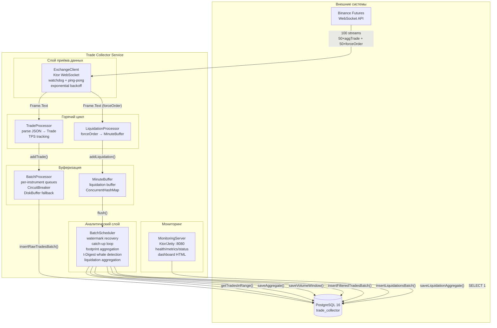
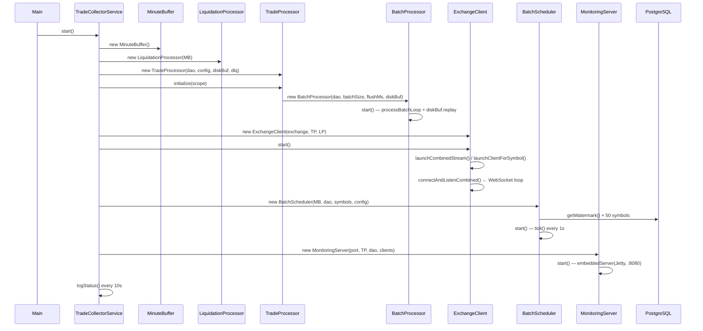
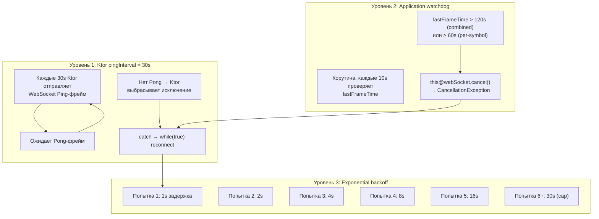
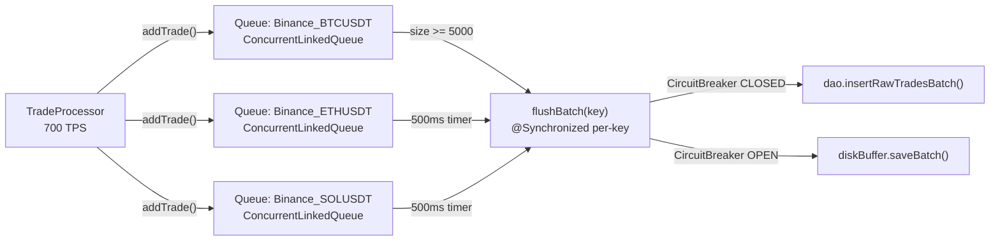
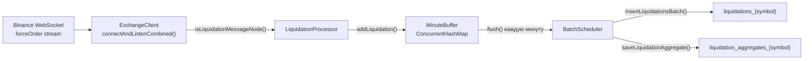
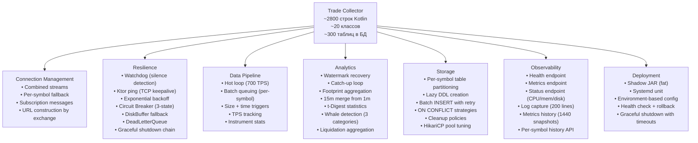

# Trade Collector Service — Полная техническая спецификация

> **Версия**: 2.0.0  
> **Статус**: Production  
> **Платформа**: JVM 21, Kotlin 2.2.20, PostgreSQL 16  
> **Ресурсы**: 768 MB heap, 50 инструментов, ~500 TPS в пике  

---

## Оглавление

1. [Предназначение сервиса](#1-предназначение-сервиса)
2. [Архитектурная схема](#2-архитектурная-схема)
3. [Точка входа и жизненный цикл](#3-точка-входа-и-жизненный-цикл)
4. [Конфигурация](#4-конфигурация)
5. [Exchange Adapters: абстракция бирж](#5-exchange-adapters-абстракция-бирж)
6. [WebSocket клиент: многослойная защита соединения](#6-websocket-клиент-многослойная-защита-соединения)
7. [Trade Processor: горячий цикл](#7-trade-processor-горячий-цикл)
8. [Batch Processor: буферизация и устойчивость к отказам](#8-batch-processor-буферизация-и-устойчивость-к-отказам)
9. [Batch Scheduler: аналитический движок](#9-batch-scheduler-аналитический-движок)
10. [t-Digest: статистика без O(n log n)](#10-t-digest-статистика-без-on-log-n)
11. [Liquidation Pipeline](#11-liquidation-pipeline)
12. [Database Architecture](#12-database-architecture)
13. [Monitoring & Observability](#13-monitoring--observability)
14. [Deployment & Infrastructure](#14-deployment--infrastructure)
15. [Failure Modes & Resilience](#15-failure-modes--resilience)
16. [Performance Characteristics](#16-performance-characteristics)
17. [Сложность микросервиса: анализ](#17-сложность-микросервиса-анализ)
18. [API Reference](#18-api-reference)

---

## 1. Предназначение сервиса

Trade Collector — это демон сбора, агрегации и статистического анализа криптовалютных сделок в реальном времени. Он подключается к WebSocket API криптобирж, реплицирует поток сделок в PostgreSQL, строит footprint-свечи (поминутные кластерные графики с bid/ask-распределением по ценовым уровням), вычисляет статистику объёмов и детектирует аномально крупные «китовые» сделки.

**Сервис НЕ является**: трейдинговым ботом, исполняющим ордера, или пользовательским приложением. Это инфраструктурный компонент — источник данных для downstream-систем (market-data-server, Nous Platform).

### Ключевые метрики

| Метрика | Значение |
|---------|----------|
| Инструментов | 50 (Perpetual Futures Binance) |
| WebSocket streams | 100 (50 aggTrade + 50 forceOrder) |
| Трейдов в секунду | 200-700 (зависит от рынка) |
| Всего трейдов обработано | >75 миллионов |
| Задержка сделка→БД | < 500 мс (batch flush) |
| Задержка сделка→агрегат | +0-60 сек (ждём границу минуты) |
| Размер БД | ~735 MB (25 000 свечей × 50 символов) |

---

## 2. Архитектурная схема



---

## 3. Точка входа и жизненный цикл

### 3.1 `Main.kt` — загрузка

```kotlin
fun main() = runBlocking {
    // 1. Загрузка конфига из 7 возможных путей
    val configLoaded = ConfigManager.loadFromEnv()

    // 2. Валидация: только PostgreSQL
    if (config.database.type.lowercase() != "postgresql") exitProcess(1)

    // 3. Создание HikariCP пула (15 соединений)
    val hikariDataSource = TradeDAO.createDataSource(config.database)
    val dao = TradeDAO(hikariDataSource)

    // 4. Оркестратор
    val service = TradeCollectorService(dao, config)

    // 5. Graceful shutdown
    Runtime.getRuntime().addShutdownHook(Thread {
        runBlocking {
            ShutdownChain()
                .step("Service", 60_000) { service.stop() }
                .step("DAO", 15_000) { dao.shutdown() }
                .execute()
        }
    })

    // 6. Запуск + бесконечное ожидание
    service.start()
    while (service.isRunning()) delay(1000)
}
```

### 3.2 `TradeCollectorService.start()` — порядок инициализации



### 3.3 `ShutdownChain` — последовательная остановка

```
Step 1: BatchScheduler (timeout 30s)
  → scheduler.stop() — отменяет tick() корутину
Step 2: TradeProcessor (timeout 30s)
  → processor.shutdown() — останавливает BatchProcessor
Step 3: ExchangeClients (timeout 15s)
  → client.stop() для каждого — закрывает WebSocket, отменяет scope
Step 4: MonitoringServer (timeout 5s)
  → server.stop() — останавливает Jetty
```

Каждый шаг имеет таймаут. Таймаут или исключение в одном шаге не блокирует следующие.

---

## 4. Конфигурация

### 4.1 Иерархия

```
config.json / config/config.prod.json (JSON на диске)
    └── переменные окружения (DB_HOST, DB_PORT, DB_NAME, DB_USER, DB_PASSWORD)
        └── Консольный аргумент CONFIG_PATH (опционально)
```

### 4.2 `AppConfig` — структура

```kotlin
@Serializable
data class AppConfig(
    val exchanges: List<ExchangeConfig>,      // биржи и их символы
    val database: DatabaseConfig,             // PostgreSQL
    val processor: ProcessorConfig,           // батчинг + фильтры
    val export: ExportConfig,                 // экспорт данных
    val monitoring: MonitoringConfig           // HTTP-сервер
)
```

### 4.3 `ExchangeConfig`

```kotlin
@Serializable
data class ExchangeConfig(
    val name: String,                          // "Binance"
    val symbols: List<String>,                 // 50 инструментов
    val enabled: Boolean = true,               // вкл/выкл
    val collectLiquidations: Boolean = false   // сбор forceOrder
)
```

### 4.4 `DatabaseConfig`

```kotlin
@Serializable
data class DatabaseConfig(
    val type: String = "postgresql",
    val host: String,         port: Int,         database: String,
    val username: String,     password: String?,
    val batchSize: Int = 1000,
    val flushIntervalMs: Long = 1000
) {
    // Все поля имеют resolved*-версии, которые сначала проверяют System.getenv()
    val resolvedHost = System.getenv("DB_HOST") ?: host
    val resolvedPort = System.getenv("DB_PORT")?.toIntOrNull() ?: port
    // ...
    val resolvedPassword: String
        get() = System.getenv("DB_PASSWORD") ?: password
            ?: throw IllegalStateException("DB_PASSWORD not configured!")
}
```

### 4.5 `ProcessorConfig`

```kotlin
@Serializable
data class ProcessorConfig(
    val batchSize: Int = 5000,              // размер батча raw_trades
    val flushIntervalMs: Long = 500,        // интервал сброса очереди
    val whaleWindowSize: Int = 10000,       // окно для детекции китов
    val whalePercentile: Double = 0.98,     // порог перцентиля
    val timeframes: List<String> = listOf("1m", "15m")
)
```

### 4.6 `ConfigManager`

- Ищет файл конфигурации в **7 возможных путях**: `config.json`, `../config.json`, `../../config.json`, `src/main/resources/config.json`, `$user.dir/config.json`, `config/config.prod.json`, `$user.dir/config/config.prod.json`
- Парсит JSON через `kotlinx.serialization` с `ignoreUnknownKeys = true` и `coerceInputValues = true`
- Имеет `loadFromEnv()` — читает `CONFIG_PATH` из переменных окружения

---

## 5. Exchange Adapters: абстракция бирж

### 5.1 Иерархия

```kotlin
interface ExchangeAdapter {
    val name: String
    
    // Single-symbol stream
    fun getWebSocketUrl(symbol: String): String
    fun getSubscribeMessage(symbol: String): String?
    fun parseTrade(json: String, symbol: String): Trade?
    fun isTradeMessage(json: String): Boolean
    
    // Combined stream (multiple symbols in one WS connection)
    fun supportsCombinedStream(): Boolean
    fun getCombinedStreamUrl(symbols: List<String>): String
    fun parseCombinedFrame(json: String): Pair<String, JsonNode>?
    fun isTradeMessageNode(node: JsonNode): Boolean
    fun parseTradeNode(node: JsonNode, symbol: String): Trade?
    
    // Liquidation support
    fun getLiquidationStreamSuffix(): String
    fun getCombinedStreamUrlWithLiq(symbols: List<String>, includeLiquidations: Boolean): String
    fun isLiquidationMessageNode(node: JsonNode): Boolean
    fun parseLiquidationNode(node: JsonNode, symbol: String): LiquidationOrder?
}
```

### 5.2 `BinanceAdapter`

**Combined stream URL pattern:**
```
wss://fstream.binance.com/market/stream?streams=
  btcusdt@aggTrade/btcusdt@forceOrder/
  ethusdt@aggTrade/ethusdt@forceOrder/
  ...50 пар...
```

Важные детали реализации:
- Используется **futures** endpoint (`fstream.binance.com`), а не spot
- `isBuy = !node["m"].asBoolean()` — поле `m` в Binance означает "является ли покупатель мейкером", поэтому инвертировано
- Ликвидации: `isLong = (side == "SELL")` — SELL-ликвидация означает закрытие длинной позиции
- Цена ликвидации берётся из `ap` (averagePrice), fallback на `p` (order price)

### 5.3 `BybitAdapter`

- **Не поддерживает combined stream** — по одному WebSocket на символ
- Использует **spot** WebSocket (`wss://stream.bybit.com/v5/public/spot`)
- Требует отправки subscribe-сообщения после подключения
- Не поддерживает ликвидации

### 5.4 `ExchangeAdapterFactory`

```kotlin
object ExchangeAdapterFactory {
    fun createAdapter(exchange: String): ExchangeAdapter = when (exchange.lowercase()) {
        "binance" -> BinanceAdapter()
        "bybit" -> BybitAdapter()
        else -> throw IllegalArgumentException("Unknown exchange: $exchange")
    }
}
```

---

## 6. WebSocket клиент: многослойная защита соединения

### 6.1 Уровни защиты



### 6.2 Почему три уровня

**Ktor ping (уровень 1)**: обрабатывает «чистые» разрывы TCP — когда соединение закрывается на уровне сокета и Ktor получает IOException. Покрывает ~80% случаев.

**Watchdog (уровень 2)**: обрабатывает «грязные» разрывы — когда TCP-соединение остаётся открытым (keepalive работает), но данные перестают поступать. Типичный сценарий: Binance закрывает стрим на своей стороне без отправки Close-фрейма. Без watchdog приложение висело бы бесконечно (что и происходило в v2.0 — инцидент от 2026-06-16, 1.5 часа простоя).

**Exponential backoff (уровень 3)**: предотвращает DDoS на Binance при массовом переподключении (50 символов × экспоненциальная задержка).

### 6.3 Combined stream — оптимизация соединений

Вместо 100 отдельных WebSocket-соединений (50 aggTrade + 50 forceOrder) используется **одно** combined-соединение через Binance multistream endpoint:

```
Одно TCP-соединение → 100 логических потоков
```

Это снижает нагрузку на сеть и упрощает управление соединениями.

### 6.4 `connectAndListenCombined()` — полный код

```kotlin
private suspend fun connectAndListenCombined(url: String, client: HttpClient) {
    var reconnectAttempts = 0
    val maxReconnectDelay = 30000L
    val silenceTimeoutMs = 120_000L          // 2 минуты для combined stream
    var frameCount = 0

    while (true) {                            // Бесконечный цикл переподключения
        try {
            reconnectAttempts++
            log.info { "combine connect attempt #$reconnectAttempts" }

            client.webSocket(url) {           // Ktor WebSocket сессия
                reconnectAttempts = 0          // Сброс при успешном подключении
                frameCount = 0

                var lastFrameTime = System.currentTimeMillis()

                // === WATCHDOG ===
                val watchdog = launch {
                    while (isActive) {
                        delay(10_000)          // Проверка каждые 10 секунд
                        if (System.currentTimeMillis() - lastFrameTime > silenceTimeoutMs) {
                            log.warn { "Combined: NO frames for ${silenceTimeoutMs/1000}s" }
                            this@webSocket.cancel("Combined stream silence timeout")
                        }
                    }
                }

                // === FRAME LOOP ===
                for (frame in incoming) {
                    lastFrameTime = System.currentTimeMillis()  // Обновление на ЛЮБОЙ фрейм

                    when (frame) {
                        is Frame.Text -> {
                            frameCount++
                            val text = frame.readText()
                            val parsed = adapter.parseCombinedFrame(text) ?: continue
                            val (symbol, node) = parsed

                            when {
                                adapter.isLiquidationMessageNode(node) -> {
                                    liquidationProcessor?.process(
                                        adapter.parseLiquidationNode(node, symbol)
                                    )
                                }
                                adapter.isTradeMessageNode(node) -> {
                                    processor.process(node.toString(), config.name, symbol)
                                }
                            }
                        }
                        is Frame.Close -> {
                            log.info { "combined connection closed (${frame.readReason()?.message})" }
                            break  // Выход из for — переход к catch/reconnect
                        }
                        else -> {}  // Ping/Pong обрабатываются Ktor автоматически
                    }
                }
                watchdog.cancel()              // Чистая остановка watchdog
            }
        } catch (e: Exception) {
            val delayMs = calculateReconnectDelay(reconnectAttempts, maxReconnectDelay)
            log.warn { "combined error (${e.message}), reconnecting in ${delayMs/1000}s" }
            delay(delayMs)
        }
    }
}
```

### 6.5 Per-symbol watchdog (60 секунд)

Per-symbol вариант идентичен combined, но с таймаутом 60 секунд вместо 120. Дополнительно:
- Отправляет subscribe-сообщение после подключения
- Обновляет `lastTradeTime` на **все** типы фреймов (Ping, Pong, Text) — чтобы watchdog не считал пинги за тишину

---

## 7. Trade Processor: горячий цикл

### 7.1 `TradeProcessor.process()` — на каждый трейд

```kotlin
fun process(json: String, exchange: String, symbol: String) {
    val adapter = getAdapter(exchange)              // кешируется
    val trade = adapter.parseTrade(json, symbol)    // Jackson парсинг
    
    if (trade != null) {
        totalTrades++                                // счётчик
        updateTps()                                  // TPS за последнюю секунду
        
        val stats = instrumentStats.getOrPut(trade.key) { InstrumentStats() }
        stats.totalTrades.incrementAndGet()           // per-symbol статистика
        stats.lastTradeTime.set(System.currentTimeMillis())
        
        batchProcessor.addTrade(trade)               // → очередь батчинга
        stats.batchQueueSize.set(batchProcessor.getQueueSize(trade.key))
        
        if (totalTrades % 1000 == 0L) {
            log.debug { "tick #$totalTrades | tps=$tps" }  // лог каждые 1000
        }
    }
}
```

### 7.2 TPS tracking

```kotlin
private fun updateTps() {
    val currentSecond = System.currentTimeMillis() / 1000
    if (currentSecond != lastSecond) {
        tradesPerSecond = (totalTrades - lastTotalTrades).toInt()
        lastTotalTrades = totalTrades
        lastSecond = currentSecond
    }
}
```

Сравнивает `totalTrades` на границах секунд. `tradesPerSecond` — это количество трейдов за предыдущую полную секунду.

### 7.3 Adapter caching

```kotlin
private fun getAdapter(exchange: String): ExchangeAdapter {
    return adapterCache.getOrPut(exchange) {
        ExchangeAdapterFactory.createAdapter(exchange)
    }
}
```

ExchangeAdapter не имеет состояния — один экземпляр используется для всех трейдов данной биржи.

---

## 8. Batch Processor: буферизация и устойчивость к отказам

### 8.1 Архитектура очередей



### 8.2 Два триггера сброса

| Триггер | Условие | Цель |
|---------|---------|------|
| **Размер очереди** | `queue.size >= batchSize (5000)` | Немедленный сброс при высокой нагрузке |
| **Таймер** | Каждые `flushIntervalMs (500)` | Регулярный сброс для низконагруженных символов |

### 8.3 Circuit Breaker

```kotlin
private class CircuitBreaker(
    private val failureThreshold: Int = 3,          // ошибок для открытия
    private val resetTimeoutMs: Long = 30_000       // таймаут сброса
) {
    enum class State { CLOSED, OPEN, HALF_OPEN }

    // CLOSED: разрешает вызовы
    // → 3 ошибки подряд → OPEN
    // OPEN: блокирует вызовы на 30 секунд
    // → таймаут → HALF_OPEN
    // HALF_OPEN: разрешает один пробный вызов
    // → успех → CLOSED | ошибка → OPEN
}
```

**Срабатывание**: 3 последовательные ошибки `insertRawTradesBatch()` (DB недоступна) → CircuitBreaker открывается. Все последующие трейды пишутся в `DiskBuffer` (JSONL-файл на диске).

**Восстановление**: через 30 секунд пропускается один пробный вызов. Успех → CLOSED, все последующие трейды снова идут в БД. Ошибка → OPEN ещё на 30 секунд.

### 8.4 `DiskBuffer` — fallback на диск

```kotlin
class DiskBuffer(dataDir: String) {
    private val bufferFile = File(dataDir, "disk_buffer.jsonl")
    
    @Synchronized
    fun saveBatch(trades: List<Trade>) {
        bufferFile.appendText(trades.joinToString("\n") { it.toJson() } + "\n")
    }
    
    @Synchronized
    fun replayTo(dao: TradeDAO) {
        if (!bufferFile.exists()) return
        val trades = bufferFile.readLines().mapNotNull { Trade.fromJson(it) }
        dao.insertRawTradesBatch(trades)
        bufferFile.delete()
    }
    
    fun hasPending(): Boolean = bufferFile.exists() && bufferFile.length() > 0
}
```

При старте сервиса `DiskBuffer.replayTo()` восстанавливает трейды, записанные во время сбоя БД.

### 8.5 Per-key синхронизация

```kotlin
private fun flushBatch(key: String) {
    val lock = flushLocks.getOrPut(key) { Any() }
    synchronized(lock) {
        val queue = tradeQueues[key] ?: return
        val batch = mutableListOf<Trade>()
        while (batch.size < batchSize && queue.isNotEmpty()) {
            batch.add(queue.poll())
        }
        // ... вставка в БД
    }
}
```

Каждый инструмент имеет **свой lock-объект**. Блокировка ETHUSDT не мешает BTCUSDT. Это предотвращает head-of-line blocking между инструментами.

---

## 9. Batch Scheduler: аналитический движок

### 9.1 Watermark Recovery

При старте сервиса BatchScheduler **восстанавливает состояние** из существующих агрегатов:

```kotlin
fun start(scope: CoroutineScope) {
    symbols.forEach { symbol ->
        listOf("1m", "15m").forEach { tf ->
            val wm = getWatermark(symbol, tf)  // SELECT MAX(end_time) FROM aggregates_{symbol}
            watermarks["${symbol}_$tf"] = wm
        }
    }
    // Запуск tick() каждую секунду
}
```

Это позволяет сервису пережить рестарт без потери данных — он продолжит с той минуты, на которой остановился.

### 9.2 Catch-up Loop

```kotlin
private fun processSymbol(symbol: String, currentMinute: Long) {
    var wm = watermarks["${symbol}_1m"] ?: (currentMinute - 60_000)
    if (wm <= 0) wm = currentMinute - 60_000
    
    // Цикл догоняет пропущенные минуты
    while (wm < currentMinute) {
        val start = wm
        val end = start + 60_000
        val isLastMinute = (end >= currentMinute)
        
        val trades = getTradesInRange(symbol, start, end)   // SQL → raw_trades
        if (trades.isNotEmpty()) {
            build1mAggregate(symbol, start, end, trades)      // → footprint
            
            // ТОЛЬКО на последней минуте: полная статистика
            if (isLastMinute) {
                val recentTrades = dao.getRecentRawTrades("Binance", symbol, 10_000)
                recalculateVolumeStats(symbol, recentTrades, start, end)
            }
        } else {
            saveEmptyAggregate(symbol, "1m", start, end)      // пустая свеча
        }
        
        // Cleanup только на последней минуте
        if (isLastMinute) {
            dao.cleanupOldRawTrades(symbol, 10_000)
            dao.cleanupOldDerivedData(symbol, 86_400_000L)
        }
        
        wm = end
        watermarks["${symbol}_1m"] = wm
    }
}
```

### 9.3 Footprint Aggregation

```kotlin
private fun build1mAggregate(symbol: String, start: Long, end: Long, trades: List<Trade>) {
    val priceLevels = linkedMapOf<BigDecimal, PriceLevelData>()
    var minPrice = BigDecimal.ZERO; var maxPrice = BigDecimal.ZERO
    
    trades.forEach { trade ->
        val p = trade.price; val q = trade.quantity
        if (priceLevels.isEmpty()) { minPrice = p; maxPrice = p }
        else { if (p < minPrice) minPrice = p; if (p > maxPrice) maxPrice = p }
        
        val level = priceLevels.getOrPut(p) { PriceLevelData(p) }
        if (trade.isBuy) { level.bidVolume += q; level.bidCount++ }
        else { level.askVolume += q; level.askCount++ }
    }

    val json = buildPriceLevelsJson(priceLevels.values.sortedBy { it.price })
    val candle = AggregateCandle(
        exchange = "Binance", symbol = symbol, timeframe = "1m",
        startTime = start, endTime = end,
        priceLevelsJson = json,
        totalTicks = trades.size.toLong(),
        minPrice = minPrice, maxPrice = maxPrice,
        priceLevels = priceLevels.size
    )
    dao.saveAggregate(candle)
}
```

**PriceLevelsJson** — это компактный формат:
```json
[[64200.00, 1.5, 2.3, 3, 5], [64200.50, 0.8, 1.1, 2, 4]]
```
Каждый элемент: `[price, bidVolume, askVolume, bidCount, askCount]`.

### 9.4 15m Aggregation — слияние 1m свечей

```kotlin
private fun build15mAggregate(symbol: String, current15m: Long) {
    val start = current15m - 900_000; val end = current15m
    
    // Читаем 15 × 1m агрегатов (вместо сырых трейдов)
    val qmAggregates = dao.get1mAggregates(symbol, start, end)
    if (qmAggregates.isEmpty()) return

    val priceLevels = linkedMapOf<BigDecimal, PriceLevelData>()
    for (agg in qmAggregates) {
        val levels = parsePriceLevelsJson(agg.priceLevelsJson)  // десериализация
        for (level in levels) {
            val existing = priceLevels.getOrPut(level.price) { PriceLevelData(level.price) }
            existing.bidVolume += level.bidVolume; existing.askVolume += level.askVolume
            existing.bidCount += level.bidCount; existing.askCount += level.askCount
        }
    }
    // Сохраняем объединённую свечу
}
```

**Оптимизация**: вместо SELECT из `raw_trades` за 15 минут (потенциально сотни тысяч строк), читаются 15 строк из `aggregates` и мержатся в памяти.

---

## 10. t-Digest: статистика без O(n log n)

### 10.1 Почему t-Digest, а не полная сортировка

**StreamingWhaleDetector v3 (удалён)**: `sorted()` 10 000 элементов × 700 TPS = **~200M операций/сек** на одном ядре → CPU 100%.

**t-Digest (текущий)**: 
- `add(volume)` — **O(log n)** для вставки, а не O(n)
- `quantile(0.98)` — один запрос раз в минуту, а не на каждый трейд
- 700 TPS: 700 × O(log 10000) ≈ 9 100 операций/сек + 1 quantile/мин

Экономия: **~20 000x** по CPU.

### 10.2 `recalculateVolumeStats()` — полный код

```kotlin
private fun recalculateVolumeStats(symbol: String, trades: List<Trade>, 
                                    windowStart: Long, windowEnd: Long) {
    if (trades.isEmpty()) return

    val digest = MergingDigest(100.0)         // t-Digest с компрессией 100
    var ewmaMean = 0.0
    var totalSum = 0.0; var totalSumSq = 0.0
    var minVol = Double.MAX_VALUE; var maxVol = 0.0
    val alpha = 1.0 / trades.size.coerceAtLeast(1)

    // === ОДИН ПРОХОД ПО ВСЕМ ТРЕЙДАМ ===
    for (trade in trades) {
        val vol = trade.getVolumeUsd().toDouble()
        ewmaMean = alpha * vol + (1 - alpha) * ewmaMean    // EWMA
        digest.add(vol)                                      // t-Digest
        totalSum += vol; totalSumSq += vol * vol
        if (vol < minVol) minVol = vol
        if (vol > maxVol) maxVol = vol
    }

    val n = trades.size.toDouble()
    val avgVolume = totalSum / n
    val variance = ((totalSumSq / n) - (avgVolume * avgVolume)).coerceAtLeast(0.0)
    
    val window = VolumeWindow(
        exchange = "Binance", symbol = symbol,
        startTime = windowStart, endTime = windowEnd,
        totalTrades = trades.size,
        minVolume = BigDecimal.valueOf(minVol),
        maxVolume = BigDecimal.valueOf(maxVol),
        avgVolume = BigDecimal.valueOf(avgVolume),
        medianVolume = BigDecimal.valueOf(digest.quantile(0.5)),
        stddevVolume = BigDecimal.valueOf(sqrt(variance)),
        p50Volume = BigDecimal.valueOf(digest.quantile(0.5)),
        p95Volume = BigDecimal.valueOf(digest.quantile(0.95)),
        p98Volume = BigDecimal.valueOf(digest.quantile(0.98)),
        p99Volume = BigDecimal.valueOf(digest.quantile(0.99)),
        filterPercentile = 0.98,
        filterThreshold = BigDecimal.valueOf(digest.quantile(0.98))
    )
    dao.saveVolumeWindow(window)

    // === WHALE DETECTION ===
    val volumeThreshold = BigDecimal.valueOf(digest.quantile(0.98))
    val batch = mutableListOf<FilteredTrade>()
    for (trade in trades) {
        val volUsd = trade.getVolumeUsd()
        if (volUsd >= volumeThreshold) {
            val category = when {
                volUsd >= BigDecimal.valueOf(digest.quantile(0.995)) -> TradeCategory.WHALE
                volUsd >= BigDecimal.valueOf(digest.quantile(0.99))  -> TradeCategory.VERY_LARGE
                else -> TradeCategory.LARGE
            }
            batch.add(FilteredTrade(trade, volUsd, 0.98, volumeThreshold, category, ...))
        }
    }
    if (batch.isNotEmpty()) dao.insertFilteredTradesBatch(batch)
}
```

### 10.3 Категории китовых сделок

| Категория | Порог | Частота |
|-----------|-------|---------|
| `LARGE` | > p98 | ~2% сделок |
| `VERY_LARGE` | > p99 | ~1% |
| `WHALE` | > p99.5 | ~0.5% |

---

## 11. Liquidation Pipeline

### 11.1 Поток данных



### 11.2 `LiquidationProcessor`

```kotlin
class LiquidationProcessor(
    private val buffer: MinuteBuffer,
    private val enabled: Boolean = true
) {
    private var totalCount = 0L
    
    fun process(order: LiquidationOrder) {
        if (!enabled) return
        buffer.addLiquidation(order.symbol, order)
        totalCount++
        if (totalCount % 1000 == 0L) log.debug { "Liquidations: $totalCount" }
    }
}
```

### 11.3 `MinuteBuffer`

```kotlin
class MinuteBuffer {
    private val liquidationBuffer = ConcurrentHashMap<String, MutableList<LiquidationOrder>>()
    
    fun addLiquidation(symbol: String, liq: LiquidationOrder) {
        liquidationBuffer.getOrPut(symbol.uppercase()) { mutableListOf() }
            .let { synchronized(it) { it.add(liq) } }
    }
    
    fun flush(): LiquidationData {
        val liquidations = mutableMapOf<String, List<LiquidationOrder>>()
        liquidationBuffer.forEach { (symbol, list) ->
            synchronized(list) {
                if (list.isNotEmpty()) { liquidations[symbol] = list.toList(); list.clear() }
            }
        }
        return LiquidationData(liquidations)
    }
}
```

### 11.4 BatchScheduler.processLiquidations()

```kotlin
private fun processLiquidations(liqs: Map<String, List<LiquidationOrder>>) {
    val end = System.currentTimeMillis() / 60_000 * 60_000
    val start = end - 60_000

    liqs.forEach { (symbol, orders) ->
        // 1. Raw liquidation records
        dao.insertLiquidationsBatch(symbol, orders)
        
        // 2. Footprint-style aggregation: long→bid, short→ask
        val priceLevels = linkedMapOf<BigDecimal, PriceLevelData>()
        orders.forEach { liq ->
            val p = liq.price; val q = liq.quantity
            val level = priceLevels.getOrPut(p) { PriceLevelData(p) }
            if (liq.isLong) { level.bidVolume += q; level.bidCount++ }
            else { level.askVolume += q; level.askCount++ }
        }
        
        // 3. Save aggregated
        dao.saveLiquidationAggregate(symbol, start, orders)
        
        // 4. Cleanup old data
        dao.cleanupOldLiquidations(symbol, 86_400_000L)
    }
}
```

---

## 12. Database Architecture

### 12.1 Per-symbol таблицы

Для каждого из 50 символов создаётся **6 таблиц**:

```
raw_trades_{symbol}              — сырые сделки (до 10 000 строк)
aggregates_{symbol}              — footprint свечи (1m + 15m)
filtered_trades_{symbol}         — китовые сделки
volume_windows_{symbol}          — статистика объёмов
liquidations_{symbol}            — сырые ликвидации
liquidation_aggregates_{symbol}  — агрегированные ликвидации
```

**Итого: 50 × 6 = 300 таблиц** в схеме `public`.

### 12.2 Схема таблиц

#### `raw_trades_{symbol}`
```sql
CREATE TABLE raw_trades_{symbol} (
    id          BIGSERIAL PRIMARY KEY,
    exchange    VARCHAR(20)    NOT NULL,
    symbol      VARCHAR(20)    NOT NULL,
    timestamp   BIGINT         NOT NULL,
    price       DECIMAL(20,8)  NOT NULL,
    quantity    DECIMAL(30,8)  NOT NULL,
    is_buy      BOOLEAN        NOT NULL,
    created_at  TIMESTAMP DEFAULT CURRENT_TIMESTAMP
);
CREATE INDEX idx_raw_trades_{symbol}_ts ON raw_trades_{symbol} (timestamp DESC);
```

#### `aggregates_{symbol}`
```sql
CREATE TABLE aggregates_{symbol} (
    id                  UUID DEFAULT uuid_generate_v4() PRIMARY KEY,
    exchange            VARCHAR(20)    NOT NULL,
    symbol              VARCHAR(20)    NOT NULL,
    timeframe           VARCHAR(10)    NOT NULL CHECK (timeframe IN ('1m','5m','15m','30m','1h','4h','1d')),
    start_time          BIGINT         NOT NULL,
    end_time            BIGINT         NOT NULL,
    price_levels_jsonb  JSONB          NOT NULL,        -- [[price,bidVol,askVol,bidCnt,askCnt],...]
    total_ticks         BIGINT         NOT NULL,
    min_price           DECIMAL(20,8)  NOT NULL,
    max_price           DECIMAL(20,8)  NOT NULL,
    price_levels        INTEGER        NOT NULL,
    UNIQUE (exchange, symbol, timeframe, start_time, end_time)
);
```

#### `filtered_trades_{symbol}`
```sql
CREATE TABLE filtered_trades_{symbol} (
    id                   BIGSERIAL PRIMARY KEY,
    -- ... поля Trade ...
    volume_usd           DECIMAL(30,2)  NOT NULL,
    percentile_threshold DECIMAL(5,2)   NOT NULL,
    volume_threshold     DECIMAL(30,8)  NOT NULL,
    trade_category       VARCHAR(20),             -- LARGE, VERY_LARGE, WHALE
    window_start_time    BIGINT         NOT NULL,
    window_end_time      BIGINT         NOT NULL,
    window_total_trades  INTEGER        NOT NULL,
    UNIQUE (timestamp, price, quantity, is_buy)   -- дедупликация
);
```

#### `liquidations_{symbol}`
```sql
CREATE TABLE liquidations_{symbol} (
    timestamp   BIGINT NOT NULL,
    price       DECIMAL(20,8) NOT NULL,
    quantity    DECIMAL(30,8) NOT NULL,
    is_long     BOOLEAN NOT NULL,
    order_type  VARCHAR(10),
    PRIMARY KEY (timestamp, price, quantity)
);
```

#### `liquidation_aggregates_{symbol}`
```sql
CREATE TABLE liquidation_aggregates_{symbol} (
    start_time        BIGINT NOT NULL,
    end_time          BIGINT NOT NULL,
    long_count        INT DEFAULT 0,
    long_volume       DECIMAL(30,8) DEFAULT 0,
    short_count       INT DEFAULT 0,
    short_volume      DECIMAL(30,8) DEFAULT 0,
    PRIMARY KEY (start_time)
);
```

### 12.3 Lazy Table Creation

```kotlin
private val ensuredTables = ConcurrentHashMap.newKeySet<String>()

private fun ensureTables(symbol: String) {
    val key = symbol.lowercase()
    if (!ensuredTables.add(key)) return       // Уже созданы — пропускаем
    
    dataSource.connection.use { conn ->
        val stmt = conn.createStatement()
        stmt.execute("CREATE TABLE IF NOT EXISTS raw_trades_${key} (...)")
        stmt.execute("CREATE TABLE IF NOT EXISTS aggregates_${key} (...)")
        // ... 6 таблиц
    }
}
```

Таблицы создаются при первом обращении к символу. Потокобезопасно через `ConcurrentHashMap.add()`.

### 12.4 HikariCP Connection Pool

```kotlin
fun createDataSource(config: DatabaseConfig): HikariDataSource {
    val hikariConfig = HikariConfig().apply {
        jdbcUrl = "jdbc:postgresql://${config.resolvedHost}:${config.resolvedPort}/${config.resolvedDatabase}"
        maximumPoolSize = 15
        minimumIdle = 5
        connectionTimeout = 30000
        idleTimeout = 600000
        maxLifetime = 1800000
        poolName = "TradePool"
        addDataSourceProperty("reWriteBatchedInserts", "true")          // batch rewrite
        addDataSourceProperty("preparedStatementCacheQueries", "1024")   // кеш statement
        addDataSourceProperty("preparedStatementCacheSizeMiB", "32")
        addDataSourceProperty("tcpKeepAlive", "true")
        leakDetectionThreshold = 2000                                    // детекция утечек
        keepaliveTime = 300_000
        connectionTestQuery = "SELECT 1"
    }
    return HikariDataSource(hikariConfig)
}
```

### 12.5 Cleanup Policies

| Таблица | Политика | Параметр |
|---------|----------|----------|
| `raw_trades` | Оставлять последние N строк | `maxRows = 10 000` |
| `aggregates` | Удалять старше retention | `retentionMs = 86 400 000` (1 день) |
| `filtered_trades` | Удалять старше retention | `retentionMs = 86 400 000` |
| `volume_windows` | Удалять старше retention | `retentionMs = 86 400 000` |
| `liquidations` | Удалять старше retention | `retentionMs = 86 400 000` |
| `liquidation_aggregates` | Удалять старше retention | `retentionMs = 86 400 000` |

---

## 13. Monitoring & Observability

### 13.1 HTTP Endpoints

| Путь | Метод | Назначение |
|------|-------|-----------|
| `/health` | GET | `{"status":"healthy"}` или `"degraded"` (проверка `SELECT 1`) |
| `/metrics` | GET | `totalTrades`, `tradesPerSecond`, `batchQueueSize`, `instruments` |
| `/status` | GET | Полный статус: версия, uptime, метрики, CPU, память, диск, БД |
| `/exchanges` | GET | Конфигурация бирж из `ConfigManager` |
| `/database/stats` | GET | Размер БД, количество raw_trades-таблиц |
| `/api/logs` | GET | Последние 200 строк лога (in-memory) |
| `/api/instruments` | GET | Per-symbol статистика (сделки, last trade time, queue size) |
| `/api/history/{symbol}` | GET | Агрегационный статус по минутам (cached 10s) |
| `/api/history/all` | GET | То же для всех символов (cached 10s) |
| `/api/metrics/history` | GET | История TPS/load/heap (последние 1440 снимков) |
| `/` | GET | Статический дашборд из `static/` (если есть) |

### 13.2 STATUS log (каждые 10 секунд)

```
STATUS | ticks=74953690 tps=43 queue=0 clients=1 mem_total=512MB mem_free=315MB
```

### 13.3 Логирование

```kotlin
// Logback → DashboardLogAppender → LogCapture (200 последних строк)
// Доступно через /api/logs
```

---

## 14. Deployment & Infrastructure

### 14.1 VPS

- **Хост**: `formyfrontend.fvds.ru` (95.81.99.28)
- **OS**: Ubuntu, 1.8 GB RAM, 40 GB SSD
- **Java**: JDK 21

### 14.2 Systemd Unit

```ini
[Unit]
Description=Trade Collector Service
After=network.target

[Service]
Type=simple
User=deploy
WorkingDirectory=/opt/trade-collector/current
Environment=APP_ENV=production
ExecStartPre=/bin/bash -c 'until pg_isready -h localhost -p 5432; do sleep 2; done'
ExecStart=/opt/trade-collector/current/run.sh
Restart=on-failure
RestartSec=10
LimitNOFILE=65536

[Install]
WantedBy=multi-user.target
```

### 14.3 JVM Flags

```
-Xmx768m -Xms512m
-XX:+UseG1GC
-XX:MaxGCPauseMillis=200
-XX:+HeapDumpOnOutOfMemoryError
```

### 14.4 Deploy Process (`make deploy`)

```bash
make deploy VPS_HOST=95.81.99.28 VPS_USER=root VPS_SSH_KEY=~/.ssh/vps_key
```

Шаги:
1. `shadowJar` (fat JAR, ~19 MB)
2. `tar.gz` упаковка (JAR + config + run.sh + systemd unit + dashboard)
3. `scp` на VPS
4. SSH: `systemctl stop`, распаковка, `systemctl start`
5. Health check: `curl http://localhost:8080/health` (до 10 попыток)
6. Rollback при провале health check

---

## 15. Failure Modes & Resilience

### 15.1 Матрица отказов

| Отказ | Детекция | Реакция | Восстановление | Потеря данных |
|--------|----------|---------|---------------|---------------|
| WebSocket disconnect | `Frame.Close` / IOException | Exponential backoff reconnect | Авто | 0 (все трейды за время разрыва потеряны, Binance не replay) |
| Silent WebSocket | Watchdog: 60s/120s без фреймов | `this@webSocket.cancel()` → reconnect | Авто | 0 |
| PostgreSQL недоступна | SQLException в `insertRawTradesBatch()` | Circuit Breaker → DiskBuffer | Авто: HALF_OPEN → CLOSED | DiskBuffer сохраняет трейды |
| PostgreSQL перегружена | Circuit Breaker: 3 ошибки → OPEN | DiskBuffer | Replay при старте | 0 (DiskBuffer) |
| Malformed WebSocket frame | `parseTrade()` → null | DeadLetterQueue (max 1000) | Ручной анализ | Трейд потерян |
| OOM | JVM crash | `-XX:+HeapDumpOnOutOfMemoryError` | Systemd restart | 0 (всё в БД) |
| Рестарт сервиса | — | Watermark recovery из aggregates | Авто: catch-up loop | 0 |
| Долгий простой (>1 дня) | Watermark сильно отстаёт | Catch-up: обработка каждой пропущенной минуты | Авто (может занять время) | 0 |
| Дубликаты трейдов | — | `ON CONFLICT DO NOTHING` на filtered_trades и liquidations | Авто | 0 |
| Дубликаты агрегатов | — | `ON CONFLICT DO UPDATE` на aggregates | Авто | 0 |

### 15.2 Наиболее вероятные сценарии

**Сценарий 1: Binance закрывает стрим без Close-фрейма**
- Частота: ~раз в 1-3 дня
- Детекция: Watchdog через 120 секунд
- Время простоя: 120 секунд
- Потеря данных: трейды за 120 секунд (Binance не предоставляет replay)

**Сценарий 2: PostgreSQL restart**
- Детекция: Circuit Breaker через 3 ошибки
- Реакция: DiskBuffer
- Восстановление: автоматическое при возврате БД
- Потеря данных: 0

**Сценарий 3: Переполнение диска**
- Детекция: OS-level мониторинг (вне сервиса)
- Реакция: Ручное вмешательство
- Предотвращение: cleanup каждую минуту (raw_trades → 10K, derived → 24h)

---

## 16. Performance Characteristics

### 16.1 Профиль нагрузки

| Метрика | Норма | Пик | Примечание |
|---------|-------|-----|-----------|
| CPU | 10-30% | 80% (BatchScheduler на границе минуты) | t-Digest quantile запрос |
| Heap | 300-450 MB | 500 MB | GC раз в ~60 секунд |
| TPS | 200-400 | 700 | Зависит от рыночной активности |
| DB connections | 5-10 | 15 (max pool) | Большинство — idle |
| WebSocket frame rate | 200-700/сек | — | Одно combined-соединение |
| Disk I/O | Низкий | Средний (BatchScheduler) | В основном WAL-запись |
| Network (out) | ~10 KB/s | ~50 KB/s | HTTP мониторинг |

### 16.2 "Hot path" vs "Cold path"

| Path | Частота | Операции |
|------|---------|----------|
| **Hot**: WebSocket → TradeProcessor → BatchProcessor | 700/сек | JSON parse + queue add |
| **Cold**: BatchScheduler.tick() | 1/сек | Проверка minute boundary |
| **Cold**: BatchScheduler.processSymbol() | 1/мин/символ | SQL SELECT + aggregate + t-Digest |
| **Cold**: Cleanup | 1/мин/символ | DELETE запросы |

Горячий путь оптимизирован для минимальных аллокаций: Jackson parse + `ConcurrentLinkedQueue.offer()`.

Холодный путь не критичен по latency — выполняется раз в минуту.

### 16.3 Оптимизации

| Оптимизация | Что даёт |
|-------------|---------|
| Combined WebSocket stream | 1 TCP соединение вместо 100 |
| t-Digest вместо сортировки | ~20 000× снижение CPU для whale detection |
| Per-symbol partition (таблицы) | Изоляция cleanup, нет contention |
| Batch INSERT | До 5000 строк за один round-trip к БД |
| `reWriteBatchedInserts=true` | PostgreSQL переписывает batch → multi-VALUES |
| Prepared statement cache | Не перекомпилирует SQL |
| Per-key locking в BatchProcessor | Нет head-of-line blocking между инструментами |
| Lazy table creation | Не создаёт таблицы для символов без трейдов |

---

## 17. Сложность микросервиса: анализ

### 17.1 Компонентная сложность

На первый взгляд, trade-collector — "просто читает WebSocket и пишет в БД". На практике, вот количество концепций, которые пришлось реализовать для production-grade сервиса:



### 17.2 Эволюция сложности

| Версия | Строк кода | Ключевые изменения |
|--------|-----------|-------------------|
| v0.1 | ~400 | Базовый WebSocket → PostgreSQL |
| v1.0 | ~1200 | BatchProcessor, CircuitBreaker, MonitoringServer |
| v2.0 | ~2000 | BatchScheduler, t-Digest, whale detection, shutdown chain, DiskBuffer, DeadLetterQueue |
| v3.0 | ~2800 | Liquidation pipeline, 50 symbols, combined forceOrder streams, watchdog fix (`this@webSocket.cancel()`) |
| v3.1 | ~2800 | t-Digest restoration (отказ от StreamingWhaleDetector), raw_trades возвращены, CPU снова нормальный |
| v3.2 (plan) | ~2900 | Historical catch-up через `GET /fapi/v1/aggTrades` — догон пропущенных трейдов при разрывах соединения |

### 17.3 Инцидент: StreamingWhaleDetector vs t-Digest

**Проблема v3.0**: `StreamingWhaleDetector` делал `sorted()` 10 000 элементов на КАЖДЫЙ трейд. При 700 TPS × 2 вызова (`addVolume` + `isWhale`) = **1400 сортировок 10K массивов в секунду** → CPU 100%.

**Решение v3.1**: Возврат t-Digest. `add(volume)` — O(log n), `quantile(0.98)` — один раз в минуту. Экономия CPU: ~20 000×.

**Вывод**: Даже в микросервисе на 2800 строк одна ошибка в O-нотации алгоритма может положить продакшен.

### 17.4 Инцидент: watchdog `cancel()` bug

**Проблема**: Оригинальный (и v3.0) код в `ExchangeClient.connectAndListenCombined()`:

```kotlin
val watchdog = launch {
    cancel("Combined stream silence timeout")  // ← ОТМЕНЯЕТ WATCHDOG, а не WebSocket!
}
```

`cancel()` внутри `launch {}` отменяет дочернюю корутину (watchdog), а не родительскую WebSocket-сессию. Watchdog молча умирал, сессия висела вечно. Сервис показывал `clients=1, tps=43`, но тики не обновлялись.

**Решение**: `this@webSocket.cancel("Combined stream silence timeout")` — явная ссылка на родительскую сессию.

**Интересно**: Этот баг существовал с **первого дня** в per-symbol watchdog. Он никогда не работал — но per-symbol потоки не использовались (только combined stream для Binance).

### 17.5 План: Historical Catch-Up через Binance REST

При разрыве WebSocket-соединения данные за gap теряются. План v3.2 добавляет:

- `HistoricalTradeFetcher` — запрос `GET /fapi/v1/aggTrades?startTime=X&endTime=Y` для догона пропущенных минут
- Те же поля `p`, `q`, `T`, `m` что и в WebSocket `aggTrade` — **совместимость 100%**
- Глубина: 24 часа
- Rate limit: 50 символов × 20 weight = 1000/2400 (42%) — безопасно

### 17.6 Что делает сервис "сложным"

Не объём кода (2800 строк — скромно), а **плотность концепций** на строку:

1. **Асинхронная модель**: корутины (не потоки), `SupervisorJob`, `CoroutineScope`, каналы `incoming`, `callbackFlow`
2. **Распределённые отказы**: WebSocket рвётся, БД падает, Binance throttles — и каждое нужно обработать по-разному
3. **Согласованность данных**: watermark recovery после рестарта, catch-up для пропущенных минут, дедупликация через UNIQUE constraints
4. **Статистика в реальном времени**: EWMA, t-Digest, перцентили, стандартное отклонение — всё за один проход по данным
5. **Оптимизация под нагрузку**: batch INSERT, prepared statement cache, per-symbol partitioning, combined streams, per-key locking
6. **Эксплуатация**: gracefule shutdown с таймаутами, health checks, rollback при deploy, логирование в память для дашборда

### 17.4 Аналогия: почему "простой микросервис" не прост

"Прочитать WebSocket → записать в БД" звучит как 50 строк кода. Но чтобы это работало **без присмотра 24/7 с recovery после любого отказа** — нужно всё перечисленное выше. Каждый дополнительный уровень надёжности добавляет ~200-300 строк специализированного кода:

| Уровень | Строк | Что даёт |
|---------|-------|----------|
| Базовая функциональность | ~300 | Connect → Parse → Insert |
| Recovery (reconnect) | +200 | Watchdog, backoff, catch-up |
| Buffering (batch) | +300 | Queues, triggers, per-key locks |
| Resilience (DB down) | +250 | Circuit Breaker, DiskBuffer, DeadLetterQueue |
| Analytics | +400 | Watermarks, t-Digest, whale detection, aggregation |
| Liquidation pipeline | +300 | MinutBuffer, LiquidationProcessor, 2 new table types |
| Monitoring | +400 | 8 endpoints, log capture, metrics history |
| Deployment | +200 | Config loading, env override, graceful shutdown |
| **Итого** | **~2800** | |

---

## 18. API Reference

### 18.1 Monitoring Server (порт 8080)

#### `GET /health`
```json
{"status": "healthy"}
```
Проверяет `SELECT 1` и статус WebSocket-клиентов.

#### `GET /status`
```json
{
    "version": "2.0.0",
    "uptime": "2d 14h 32m",
    "ticks": 74953690,
    "tps": 43,
    "queue": 0,
    "clients": 1,
    "cpu": 0.15,
    "heapUsedMB": 350,
    "heapMaxMB": 768,
    "nonHeapMB": 64,
    "dbSize": "735 MB",
    "symbols": 50
}
```

### 18.2 Database (market-data-server API, порт 8085)

#### `GET /api/instruments?exchange=Binance`
```json
[
    {"symbol": "BTCUSDT", "start": 1780676100000, "end": 1781276040000, "candles": 10660},
    {"symbol": "ETHUSDT", "start": 1780676100000, "end": 1781276040000, "candles": 10660}
]
```

#### `GET /api/footprint?symbol=BTCUSDT&timeframe=1m&limit=2`
```json
[
    {
        "exchange": "Binance", "symbol": "BTCUSDT", "timeframe": "1m",
        "startTime": 1781276280000, "endTime": 1781276340000,
        "totalTicks": 1952,
        "minPrice": "63879.00000000", "maxPrice": "63940.40000000",
        "levels": [
            {"price": "63879.00000000", "bidVolume": "0", "askVolume": "0.21400000", "bidCount": 0, "askCount": 1},
            {"price": "63940.40000000", "bidVolume": "0.01000000", "askVolume": "0", "bidCount": 0, "askCount": 1}
        ]
    }
]
```

#### `GET /api/liquidations?symbol=BTCUSDT&limit=2`
```json
[
    {"exchange": "Binance", "symbol": "BTCUSDT", "timestamp": 1782121170508,
     "price": "64033.70000000", "quantity": "0.00100000", "isLong": true, "orderType": "LIMIT"}
]
```

#### `GET /api/liquidation-aggregates?symbol=BTCUSDT&limit=2`
```json
[
    {"exchange": "Binance", "symbol": "BTCUSDT", "timeframe": "1m",
     "startTime": 1782121140000, "endTime": 1782121200000,
     "longCount": 1, "longVolume": "0.00100000", "shortCount": 0, "shortVolume": "0.00000000"}
]
```
