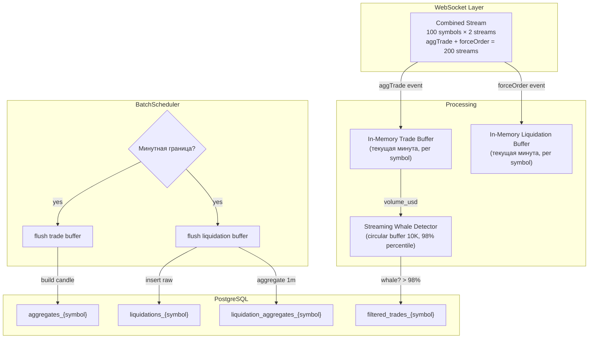

# Trade Collector v3 — Refactoring Plan

> **Статус**: Plan  
> **Версия**: 3.0  
> **Дата**: 2026-06-21  

---

## Оглавление

1. [Цели рефакторинга](#1-цели-рефакторинга)
2. [Текущее vs Новое](#2-текущее-vs-новое)
3. [Новая архитектура](#3-новая-архитектура)
4. [Top-100 Symbols](#4-top-100-symbols)
5. [Liquidation Data](#5-liquidation-data)
6. [In-Memory Buffer](#6-in-memory-buffer)
7. [Streaming Whale Detector](#7-streaming-whale-detector)
8. [BatchScheduler v3](#8-batchscheduler-v3)
9. [Database Schema](#9-database-schema)
10. [Удаляемый код](#10-удаляемый-код)
11. [Конфигурация](#11-конфигурация)
12. [Порядок выполнения](#12-порядок-выполнения)

---

## 1. Цели рефакторинга

1. **Только whale trades в БД** — не хранить все raw_trades, только крупные сделки (>98% перцентиль)
2. **Liquidation data** — добавить сбор и агрегацию ликвидаций (forceOrder)
3. **Top-100 symbols** — расширить с 20 до 100 самых торгуемых perpetual-фьючерсов
4. **Очистка БД** — полный сброс, начать сбор данных заново с новой схемой
5. **Упрощение** — удалить t-Digest, VolumeFilterProcessor, AggregateProcessor, volume_windows, raw_trades

---

## 2. Текущее vs Новое

| Аспект | v2 (сейчас) | v3 (план) |
|--------|------------|-----------|
| Symbols | 20 (хардкод) | 100 (Binance 24hr ticker топ) |
| Raw trades | `raw_trades_{symbol}` — 10K rows | ❌ Удалено — in-memory buffer |
| Aggregates | `aggregates_{symbol}` — 1m/15m | ✅ Оставлено |
| Whale trades | `filtered_trades_{symbol}` | ✅ Оставлено |
| Volume stats | `volume_windows_{symbol}` — t-Digest | ❌ Удалено — streaming detection |
| Liquidations | — | ➕ `liquidations_{symbol}` + `liquidation_aggregates_{symbol}` |
| Whale detection | t-Digest (CPU-heavy) | Streaming percentile (лёгкий) |
| WebSocket | Только `@aggTrade` | `@aggTrade` + `@forceOrder` в combined stream |

---

## 3. Новая архитектура



---

## 4. Top-100 Symbols

### Источник

`GET https://fapi.binance.com/fapi/v1/ticker/24hr`

Возвращает все perpetual-фьючерсы (~400) с полем `quoteVolume` (объём в USDT за 24ч).

### Алгоритм

```kotlin
fun fetchTopSymbols(limit: Int = 100): List<String> {
    val response = httpClient.get("https://fapi.binance.com/fapi/v1/ticker/24hr")
    val tickers = response.body<List<Ticker24hr>>()
    return tickers
        .filter { it.symbol.endsWith("USDT") }   // только perpetuals
        .sortedByDescending { it.quoteVolume }
        .take(limit)
        .map { it.symbol.lowercase() }
}
```

### Варианты интеграции

| Вариант | Как | Плюсы | Минусы |
|---------|-----|-------|--------|
| **A** | Скрипт — запускаем вручную раз в месяц | Просто, не меняет код сервиса | Ручная работа |
| **B** | Trade-collector получает при старте | Автоматически, всегда актуально | Что делать с делистингнутыми? |
| **C** | A + кеширование в конфиг | Основной путь — скрипт, fallback — закешированный список | Компромисс |

**Рекомендация A** — запустить скрипт сейчас, сохранить в `config.prod.json`. При делистинге символ просто перестанет присылать данные — WebSocket будет возвращать ошибку, лог предупредит.

### Реализация

Скрипт `scripts/update-top-symbols.sh` — curl + jq:

```bash
#!/bin/bash
LIMIT=${1:-100}
curl -s "https://fapi.binance.com/fapi/v1/ticker/24hr" | \
  jq -r '[.[] | select(.symbol | endswith("USDT"))] | sort_by(-(.quoteVolume | tonumber)) | .[:'"$LIMIT"'] | map(.symbol | ascii_downcase)' | \
  jq '{exchanges:[{name:"Binance",symbols:.,enabled:true}]}'
```

Результат: список из 100 символов для вставки в `config.prod.json`.

---

## 5. Liquidation Data

### WebSocket

```
wss://fstream.binance.com/market/ws/{symbol_lowercase}@forceOrder
```

Добавляется в существующий combined stream:

```
wss://fstream.binance.com/market/stream?streams=
  btcusdt@aggTrade/btcusdt@forceOrder/
  ethusdt@aggTrade/ethusdt@forceOrder/
  ...100 пар × 2 = 200 streams...
```

### Data Model

```kotlin
data class LiquidationOrder(
    val exchange: String,
    val symbol: String,
    val timestamp: Long,
    val price: BigDecimal,       // averagePrice (ap)
    val quantity: BigDecimal,    // original quantity (q)
    val isLong: Boolean,         // SELL side = long liquidation
    val orderType: String        // "LIMIT" or "MARKET"
)
```

### BinanceAdapter — поддержка forceOrder

```kotlin
sealed class CombinedFrame {
    data class Trade(val symbol: String, val node: JsonNode) : CombinedFrame()
    data class Liquidation(val symbol: String, val node: JsonNode) : CombinedFrame()
}

fun parseCombinedFrame(json: String): CombinedFrame? {
    val root = mapper.readTree(json)
    val stream = root["stream"]?.asText() ?: return null
    val data = root["data"] ?: return null
    
    return when {
        stream.endsWith("@aggTrade") -> {
            val symbol = stream.removeSuffix("@aggTrade").uppercase()
            CombinedFrame.Trade(symbol, data)
        }
        stream.endsWith("@forceOrder") -> {
            val symbol = stream.removeSuffix("@forceOrder").uppercase()
            CombinedFrame.Liquidation(symbol, data)
        }
        else -> null
    }
}

fun parseLiquidationNode(node: JsonNode, symbol: String): LiquidationOrder? {
    val o = node["o"] ?: return null
    return LiquidationOrder(
        exchange = "Binance",
        symbol = symbol,
        timestamp = o["T"].asLong(),
        price = BigDecimal(o["ap"]?.asText() ?: o["p"]?.asText() ?: return null),
        quantity = BigDecimal(o["q"].asText()),
        isLong = o["S"].asText() == "SELL",
        orderType = o["o"]?.asText() ?: ""
    )
}
```

### ExchangeClient — обработка liquidation frames

В `connectAndListenCombined()` после парсинга:

```kotlin
for (frame in incoming) {
    lastFrameTime = System.currentTimeMillis()
    when (frame) {
        is Frame.Text -> {
            val parsed = adapter.parseCombinedFrame(text)
            when (parsed) {
                is CombinedFrame.Trade -> {
                    if (adapter.isTradeMessageNode(parsed.node)) {
                        processor.process(parsed.node.toString(), config.name, parsed.symbol)
                    }
                }
                is CombinedFrame.Liquidation -> {
                    if (config.collectLiquidations) {
                        liquidationProcessor.process(parsed.node, parsed.symbol)
                    }
                }
                null -> { /* unparsed */ }
            }
        }
    }
}
```

---

## 6. In-Memory Buffer

Замена `raw_trades` таблице. Трейды хранятся в памяти только для текущей минуты.

```kotlin
class MinuteBuffer(
    private val whaleDetector: StreamingWhaleDetector
) {
    private val tradeBuffer = ConcurrentHashMap<String, MutableList<Trade>>()
    private val liquidationBuffer = ConcurrentHashMap<String, MutableList<LiquidationOrder>>()
    private var currentMinuteStart: Long = 0L
    private val lock = Any()
    
    fun addTrade(symbol: String, trade: Trade, volumeUsd: BigDecimal) {
        synchronized(lock) {
            val minuteStart = trade.timestamp / 60_000 * 60_000
            if (minuteStart > currentMinuteStart) {
                flush() // flush предыдущей минуты
                currentMinuteStart = minuteStart
            }
            
            // Whale detection в реальном времени
            if (whaleDetector.isWhale(volumeUsd)) {
                whaleDetector.addVolume(volumeUsd)
                // вернуть флаг "yes" — вызывающий код запишет в filtered_trades
            }
            whaleDetector.addVolume(volumeUsd)
            
            tradeBuffer.getOrPut(symbol.uppercase()) { mutableListOf() }.add(trade)
        }
    }
    
    fun addLiquidation(symbol: String, liq: LiquidationOrder) {
        synchronized(lock) {
            liquidationBuffer.getOrPut(symbol.uppercase()) { mutableListOf() }.add(liq)
        }
    }
    
    data class MinuteData(
        val minuteStart: Long,
        val trades: Map<String, List<Trade>>,
        val liquidations: Map<String, List<LiquidationOrder>>
    )
    
    fun flush(): MinuteData {
        synchronized(lock) {
            val data = MinuteData(
                minuteStart = currentMinuteStart,
                trades = tradeBuffer.toMap(),
                liquidations = liquidationBuffer.toMap()
            )
            tradeBuffer.clear()
            liquidationBuffer.clear()
            return data
        }
    }
}
```

---

## 7. Streaming Whale Detector

Замена t-Digest + EWMA + volume_windows. Лёгкий — не требует БД.

```kotlin
class StreamingWhaleDetector(
    private val windowSize: Int = 10_000,
    private val percentile: Double = 0.98
) {
    private val recentVolumes = ArrayDeque<Double>(windowSize)
    
    fun addVolume(volumeUsd: BigDecimal) {
        if (recentVolumes.size >= windowSize) recentVolumes.removeFirst()
        recentVolumes.addLast(volumeUsd.toDouble())
    }
    
    fun isWhale(volumeUsd: BigDecimal): Boolean {
        if (recentVolumes.size < 100) return false  // недостаточно данных
        val threshold = approximatePercentile(percentile)
        return volumeUsd.toDouble() >= threshold
    }
    
    fun approximatePercentile(p: Double): Double {
        if (recentVolumes.isEmpty()) return 0.0
        val sorted = recentVolumes.sorted()
        val idx = (sorted.size * p).toInt().coerceIn(0, sorted.lastIndex)
        return sorted[idx]
    }
}
```

---

## 8. BatchScheduler v3

Упрощённый — без SQL-запросов к raw_trades.

```kotlin
class BatchScheduler(
    private val buffer: MinuteBuffer,
    private val dao: TradeDAO,
    private val symbols: List<String>,
    private val config: ProcessorConfig
) {
    private var lastProcessedMinute = 0L
    private var last15mProcessed = 0L
    private var job: Job? = null
    
    fun start(scope: CoroutineScope) {
        job = scope.launch {
            while (isActive) {
                try {
                    val now = System.currentTimeMillis()
                    val currentMinute = now / 60_000 * 60_000
                    val current15m = now / 900_000 * 900_000
                    
                    if (currentMinute > lastProcessedMinute) {
                        val data = buffer.flush()
                        processMinuteData(data)
                        lastProcessedMinute = currentMinute
                    }
                    
                    if (current15m > last15mProcessed) {
                        merge15mAggregates()
                        last15mProcessed = current15m
                    }
                } catch (e: Exception) {
                    log.error(e) { "Batch cycle error" }
                }
                delay(1000)
            }
        }
    }
    
    private fun processMinuteData(data: MinuteBuffer.MinuteData) {
        // Агрегируем трейды в свечи
        for ((symbol, trades) in data.trades) {
            if (trades.isEmpty()) continue
            val candle = buildCandle(symbol, data.minuteStart, data.minuteStart + 60_000, trades)
            dao.saveAggregate(candle)
        }
        
        // Сохраняем ликвидации
        for ((symbol, liqs) in data.liquidations) {
            if (liqs.isEmpty()) continue
            dao.insertLiquidationsBatch(symbol, liqs)
            dao.saveLiquidationAggregate(symbol, data.minuteStart, liqs)
        }
        
        // Cleanup старых данных
        symbols.forEach { symbol ->
            dao.cleanupOldFilteredTrades(symbol, 86_400_000L) // 24h retention
            dao.cleanupOldLiquidations(symbol, 86_400_000L)
        }
    }
}
```

---

## 9. Database Schema

### 9.1 Создаваемые таблицы (per symbol)

```sql
-- Footprint свечи (оставлено без изменений)
CREATE TABLE aggregates_{symbol} (
    id UUID DEFAULT uuid_generate_v4() PRIMARY KEY,
    exchange VARCHAR(20) NOT NULL,
    symbol VARCHAR(20) NOT NULL,
    timeframe VARCHAR(10) NOT NULL CHECK (timeframe IN ('1m','5m','15m','30m','1h','4h','1d')),
    start_time BIGINT NOT NULL,
    end_time BIGINT NOT NULL,
    price_levels_jsonb JSONB NOT NULL,
    total_ticks BIGINT NOT NULL,
    min_price DECIMAL(20,8) NOT NULL,
    max_price DECIMAL(20,8) NOT NULL,
    price_levels INTEGER NOT NULL,
    created_at TIMESTAMP DEFAULT CURRENT_TIMESTAMP,
    UNIQUE (exchange, symbol, timeframe, start_time, end_time)
);

-- Whale trades (оставлено без изменений)
CREATE TABLE filtered_trades_{symbol} (
    id BIGSERIAL PRIMARY KEY,
    exchange VARCHAR(20) NOT NULL,
    symbol VARCHAR(20) NOT NULL,
    timestamp BIGINT NOT NULL,
    price DECIMAL(20,8) NOT NULL,
    quantity DECIMAL(30,8) NOT NULL,
    is_buy BOOLEAN NOT NULL,
    volume_usd DECIMAL(30,2) NOT NULL,
    percentile_threshold DECIMAL(5,2) NOT NULL,
    volume_threshold DECIMAL(30,8) NOT NULL,
    trade_category VARCHAR(20),
    window_start_time BIGINT NOT NULL,
    window_end_time BIGINT NOT NULL,
    window_total_trades INTEGER NOT NULL,
    created_at TIMESTAMP DEFAULT CURRENT_TIMESTAMP,
    UNIQUE (timestamp, price, quantity, is_buy)
);

-- Raw liquidations (НОВОЕ)
CREATE TABLE liquidations_{symbol} (
    timestamp BIGINT NOT NULL,
    price DECIMAL(20,8) NOT NULL,
    quantity DECIMAL(30,8) NOT NULL,
    is_long BOOLEAN NOT NULL,
    order_type VARCHAR(10),
    PRIMARY KEY (timestamp, price, quantity)
);

-- Aggregated liquidations (НОВОЕ)
CREATE TABLE liquidation_aggregates_{symbol} (
    start_time BIGINT NOT NULL,
    end_time BIGINT NOT NULL,
    long_count INT DEFAULT 0,
    long_volume DECIMAL(30,8) DEFAULT 0,
    short_count INT DEFAULT 0,
    short_volume DECIMAL(30,8) DEFAULT 0,
    PRIMARY KEY (start_time)
);
```

### 9.2 Удаляемые таблицы

```sql
DROP TABLE IF EXISTS raw_trades_{symbol};
DROP TABLE IF EXISTS volume_windows_{symbol};
```

### 9.3 Полная очистка БД

```sql
DO $$ 
DECLARE 
    r RECORD;
BEGIN
    FOR r IN (SELECT tablename FROM pg_tables 
              WHERE schemaname = 'public' 
                AND (tablename LIKE 'raw_trades_%' 
                  OR tablename LIKE 'volume_windows_%'
                  OR tablename LIKE 'aggregates_%'
                  OR tablename LIKE 'filtered_trades_%'
                  OR tablename LIKE 'liquidations_%'
                  OR tablename LIKE 'liquidation_aggregates_%')) 
    LOOP
        EXECUTE 'DROP TABLE IF EXISTS ' || quote_ident(r.tablename) || ' CASCADE';
    END LOOP;
END $$;
```

---

## 10. Удаляемый код

| Файл/Класс | Причина |
|------------|---------|
| `VolumeFilterProcessor` (весь класс) | Заменён на `StreamingWhaleDetector` |
| `AggregateProcessor` (весь класс) | Агрегация теперь в `BatchScheduler` |
| `TradeDAO.insertRawTradesBatch()` | Нет `raw_trades` |
| `TradeDAO.getRecentRawTrades()` | Нет `raw_trades` |
| `TradeDAO.saveVolumeWindow()` | Нет `volume_windows` |
| `TradeDAO.cleanupOldRawTrades()` | Нет `raw_trades` |
| `TradeDAO.ensureTables()` → raw_trades часть | Нет `raw_trades` |
| `TradeDAO.ensureTables()` → volume_windows часть | Нет `volume_windows` |
| `BatchScheduler.getTradesInRange()` | SQL-запрос → in-memory buffer |
| `BatchScheduler.recalculateVolumeStats()` | t-Digest → streaming |
| `BatchScheduler.build15mAggregate()` | Оставить, но заменить `get1mAggregates` |
| t-Digest dependency (`com.tdunning:...`) | Не нужен |
| `model/VolumeWindow.kt` | Не нужен |
| `model/FilteredTrade.kt` | Частично: убрать `VolumeWindow` поля |
| `model/AggregateCandle.kt` | Оставить |
| `BatchProcessor` (конфиг `batchSize` → только whale batch) | Упростить |
| `DiskBuffer` | Только для whale batch |
| `DeadLetterQueue` | Только для whale batch |

### Сохраняемый код

| Файл/Класс | Комментарий |
|------------|-------------|
| `ExchangeClient` | Добавить обработку liquidation frames |
| `BinanceAdapter` | Добавить `forceOrder` парсинг |
| `TradeDAO` | Оставить `saveAggregate`, `insertFilteredTradesBatch`, добавить liquidation methods |
| `TradeCollectorService` | Обновить инициализацию |
| `MonitoringServer` | Без изменений |
| `HistoryCache`, `MetricsLog` | Без изменений |
| `ShutdownChain` | Без изменений |

---

## 11. Конфигурация

### config.prod.json

```json
{
  "exchanges": [
    {
      "name": "Binance",
      "symbols": ["btcusdt", "ethusdt", "solusdt", ...100 total...],
      "enabled": true,
      "collectLiquidations": true
    }
  ],
  "database": {
    "type": "postgresql",
    "host": "localhost",
    "port": 5432,
    "database": "trade_collector",
    "username": "trade_user",
    "batchSize": 5000,
    "flushIntervalMs": 500
  },
  "processor": {
    "batchSize": 5000,
    "flushIntervalMs": 500,
    "whaleWindowSize": 10000,
    "whalePercentile": 0.98,
    "timeframes": ["1m", "15m"]
  },
  "export": {
    "enabled": true,
    "intervalMinutes": 60,
    "outputDir": "/var/lib/trade-collector/exports",
    "keepDays": 30
  },
  "monitoring": {
    "httpPort": 8080,
    "host": "0.0.0.0"
  }
}
```

---

## 12. Порядок выполнения

| # | Задача | Файлы |
|---|--------|-------|
| 1 | Скрипт top-100 символов | `scripts/update-top-symbols.sh` |
| 2 | Обновить `config.prod.json` (100 symbols + liquidation flag) | `config/config.prod.json` |
| 3 | `LiquidationOrder` модель | `model/LiquidationOrder.kt` |
| 4 | `StreamingWhaleDetector` | `service/StreamingWhaleDetector.kt` |
| 5 | `MinuteBuffer` (in-memory) | `service/MinuteBuffer.kt` |
| 6 | `BinanceAdapter` — forceOrder в combined stream | `exchange/binance/BinanceAdapter.kt` |
| 7 | `ExchangeClient` — обработка liquidation frames | `service/ExchangeClient.kt` |
| 8 | `TradeDAO` — новый schema (добавить liquidation, убрать raw/volume) | `storage/postgres/TradeDAO.kt` |
| 9 | `BatchScheduler` v3 — in-memory + liquidation aggregate | `service/BatchScheduler.kt` |
| 10 | `TradeCollectorService` — обновить инициализацию | `service/TradeCollectorService.kt` |
| 11 | Удалить старый код | `VolumeFilterProcessor`, `AggregateProcessor`, t-Digest |
| 12 | Очистить БД на VPS | `DROP TABLE raw_trades_*, volume_windows_*, aggregates_*, filtered_trades_*` |
| 13 | `make deploy` | |
