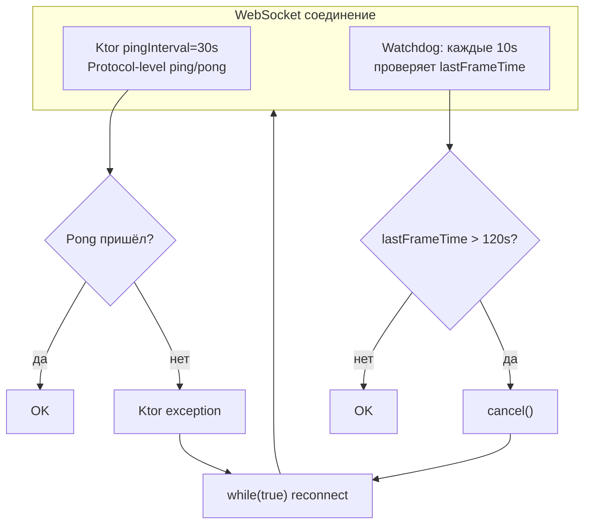

# Fix: Silent WebSocket Disconnect in Combined Stream

> **Статус**: Plan  
> **Приоритет**: HIGH  
> **Дата**: 2026-06-16  

## Проблема

Combined WebSocket stream Binance (`wss://fstream.binance.com/market/stream?streams=...`) периодически замирает без отправки Close-фрейма. Ktor WebSocket-клиент считает соединение активным, но канал `incoming` блокируется навсегда. Сервис показывает `clients=1`, `tps=43`, но тики не обновляются и данные не пишутся в БД.

**Инцидент**: 2026-06-16 в 08:14 CEST — поток данных замер. Сервис простоял 1.5 часа без переподключения. Потребовался ручной `systemctl restart`.

## Корневая причина

`ExchangeClient.connectAndListenCombined()` (строка 52) — нет silence watchdog. Есть `diagJob` который только **логирует** предупреждение, но **не переподключает**.

Per-symbol метод `connectAndListen()` (строка 142) имеет watchdog с `cancel("Trade silence timeout")` + `while(true)` переподключением.

## Решение: двухслойная защита

### Слой 1 — Ktor `pingInterval`

Добавить `pingInterval = 30_000` в конфигурацию WebSocket при создании `HttpClient`. Ktor будет отправлять ping каждые 30 секунд на протокольном уровне (RFC 6455, не application-level). Если pong не приходит — Ktor выбрасывает исключение → `while(true)` переподключает.

### Слой 2 — Application silence watchdog

Корутина, проверяющая `lastFrameTime` каждые 10 секунд. Если ни одного фрейма не пришло за 120 секунд — `cancel("Combined stream silence timeout")` → `while(true)` переподключает.



## Изменения в коде

### Файл: `src/main/kotlin/service/ExchangeClient.kt`

#### 1. `launchCombinedStream()` — добавить `pingInterval` (строка 37)

```kotlin
// Было:
val client = HttpClient {
    install(WebSockets) {
        maxFrameSize = Long.MAX_VALUE
    }
}

// Стало:
val client = HttpClient {
    install(WebSockets) {
        maxFrameSize = Long.MAX_VALUE
        pingInterval = 30_000  // ← Ktor будет сам слать ping каждые 30 секунд
    }
}
```

#### 2. `connectAndListenCombined()` — заменить `diagJob` на watchdog (строки 52-121)

```kotlin
private suspend fun connectAndListenCombined(url: String, client: HttpClient) {
    var reconnectAttempts = 0
    val maxReconnectDelay = 30000L
    val silenceTimeoutMs = 120_000L  // 2 минуты без фреймов → reconnect
    var frameCount = 0

    while (true) {
        try {
            reconnectAttempts++
            log.info { "${config.name}: combined connect attempt #$reconnectAttempts" }

            client.webSocket(url) {
                log.info { "${config.name}: combined WebSocket connected (${config.symbols.size} pairs)" }
                reconnectAttempts = 0
                frameCount = 0

                var lastFrameTime = System.currentTimeMillis()

                // Watchdog: force reconnect if no frames for silenceTimeoutMs
                val watchdog = launch {
                    while (isActive) {
                        delay(10_000)
                        if (System.currentTimeMillis() - lastFrameTime > silenceTimeoutMs) {
                            log.warn { "${config.name}: combined NO frames for ${silenceTimeoutMs / 1000}s — forcing reconnect" }
                            cancel("Combined stream silence timeout")
                        }
                    }
                }

                for (frame in incoming) {
                    lastFrameTime = System.currentTimeMillis()  // ← обновляется на ЛЮБОЙ фрейм
                    when (frame) {
                        is Frame.Text -> {
                            frameCount++
                            val text = frame.readText()
                            if (frameCount <= 5) log.debug { "${config.name}: TEXT #$frameCount len=${text.length}" }
                            val parsed = adapter.parseCombinedFrame(text)
                            if (parsed == null) {
                                if (frameCount <= 5) log.debug { "${config.name}: UNPARSED #$frameCount" }
                                continue
                            }
                            val (symbol, node) = parsed
                            if (!adapter.isTradeMessageNode(node)) {
                                if (frameCount <= 5) log.debug { "${config.name}: NON-TRADE #$frameCount $symbol" }
                                continue
                            }
                            if (frameCount <= 5) log.debug { "${config.name}: TRADE #$frameCount $symbol" }
                            processor.process(node.toString(), config.name, symbol)
                        }
                        is Frame.Ping -> { /* Ktor handle automatically */ }
                        is Frame.Pong -> { /* Ktor handle automatically */ }
                        is Frame.Close -> {
                            val reason = frame.readReason()?.message ?: "no reason"
                            log.info { "${config.name}: combined connection closed ($reason)" }
                            break
                        }
                        else -> {
                            if (frameCount <= 5) log.debug { "${config.name}: unknown frame type: ${frame::class.simpleName}" }
                        }
                    }
                }
                watchdog.cancel()
            }
        } catch (e: Exception) {
            val delayMs = calculateReconnectDelay(reconnectAttempts, maxReconnectDelay)
            log.warn { "${config.name}: combined error (${e.message}), reconnecting in ${delayMs / 1000}s" }
            delay(delayMs)
        }
    }
}
```

#### 3. `launchCombinedStream()` — добавить `pingInterval` и для per-symbol клиентов (строка 128)

```kotlin
// Было:
val client = HttpClient {
    install(WebSockets) {
        maxFrameSize = Long.MAX_VALUE
    }
}

// Стало:
val client = HttpClient {
    install(WebSockets) {
        maxFrameSize = Long.MAX_VALUE
        pingInterval = 30_000
    }
}
```

#### 4. `connectAndListen()` — добавить `lastTradeTime` обновление на ПИНГ/ПОНГ (строка 175)

```kotlin
for (frame in incoming) {
    when (frame) {
        is Frame.Text -> {
            val text = frame.readText()
            if (!adapter.isTradeMessage(text)) continue
            lastTradeTime = System.currentTimeMillis()
            processor.process(text, config.name, symbol)
        }
        is Frame.Ping -> { lastTradeTime = System.currentTimeMillis() }  // ← новое
        is Frame.Pong -> { lastTradeTime = System.currentTimeMillis() }  // ← новое
        is Frame.Close -> { ... break }
        else -> {}
    }
}
```

Без этого watchdog будет считать пинги/понги за «тишину» и переподключать даже при живом соединении.

## Почему 120 секунд для combined, а не 60

| Stream | Символов | Timeout | Причина |
|--------|----------|---------|---------|
| Per-symbol | 1 | 60s | Один символ может быть неактивен (делистинг, низкая ликвидность) |
| Combined | 20 | 120s | 20 активных символов → хотя бы один всегда торгуется. 2 минуты — однозначно dead connection |

## Почему это безопасно для Binance

- **Ktor `pingInterval`**: WebSocket-уровень (RFC 6455), не application. Binance не логирует протокольные ping/pong как API-запросы. Rate limits не применяются.
- **Watchdog `cancel()`**: чисто клиентская логика. Не генерирует сетевой трафик. Просто закрывает локальный WebSocket и переподключается через `while(true)`.
- **Переподключение**: combined stream URL содержит `/stream?streams=btcusdt@aggTrade/ethusdt@aggTrade/...`. Каждое переподключение — это **1 новое WebSocket-соединение** (в пределах лимитов Binance: 1024 streams per connection, до 200 соединений).

## План тестирования

1. `make deploy` — задеплоить новую версию
2. Дождаться ночи (низкая активность) или искусственно заблокировать WebSocket через `iptables -A OUTPUT -p tcp --dport 443 -d fstream.binance.com -j DROP` на 3 минуты
3. Проверить логи: должен появиться `combined NO frames for 120s — forcing reconnect`
4. Проверить: тики продолжают идти после разблокировки (переподключение сработало)
